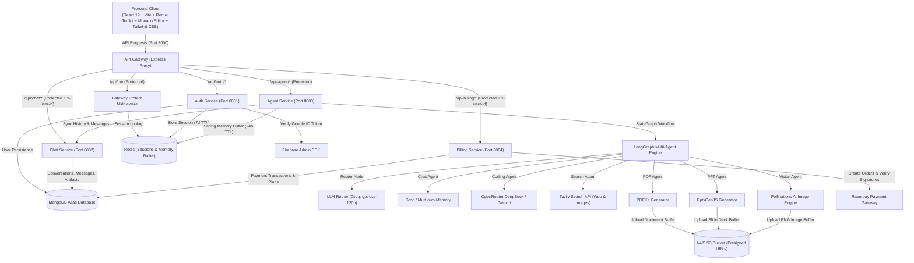
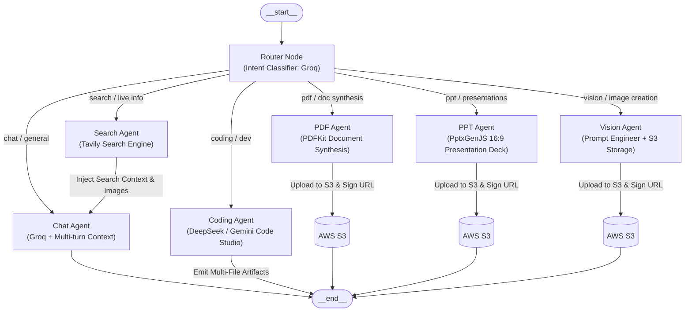

# 🧠 Omnix AI

<div align="center">

[](#)
[](#)
[](#)
[](#)
[](#)
[](#)
[](#)
[](#)

<p align="center">
  <b>An enterprise-grade, microservices-driven multi-agent AI platform built with LangGraph orchestration, distributed Redis session & memory management, interactive Monaco Editor sandbox artifacts, AWS S3 document/presentation/image asset pipelines, Razorpay billing, and a modern React 19 interface.</b>
</p>
  
</div>

---

> [!NOTE]
> **Project Status:** 🚧 **Under Active Development**  
> Core microservices architecture, Google OAuth session management, MongoDB chat persistence, LangGraph multi-agent orchestration, Tavily real-time web search, PDF & PPT generation with AWS S3 presigned downloads, AI image synthesis, Monaco Editor live code sandbox artifacts, and Razorpay billing infrastructure are fully implemented and operational.

---

## 📌 Project Overview

**Omnix AI** is a full-stack, distributed AI assistant and multi-agent execution workspace. Rather than relying on a single monolithic prompt, Omnix AI decomposes complex user requests into specialized workflows managed by autonomous agent nodes:

- **Centralized API Gateway:** A single entry-point reverse proxy managing CORS, HTTP-only cookie sessions, Redis authentication verification, and downstream authenticated identity injection (`x-user-id`).
- **Distributed Session Authentication:** Firebase Admin verification paired with secure Redis session stores (7-day TTL) and persistent `/api/me` profile hydration.
- **Dedicated Chat & Conversation Service:** MongoDB-backed conversation and message storage with support for multi-turn threads, auto-generated topic titles, image attachments, and structured code artifacts.
- **Multi-Agent Orchestration with LangGraph:** Dynamic intent routing (`@langchain/langgraph`) that classifies user prompts and dispatches execution across specialized agents (Chat, Coding, Web Search, PDF generation, PPT presentation creation, and Vision/Image synthesis).
- **Interactive Code Artifacts Studio:** Microsoft Monaco Editor integration with multi-file tabs, 20+ language highlighters, and a live sandboxed HTML/CSS/JS preview iframe.
- **Cloud Asset Pipeline (AWS S3):** Generates real `.pdf` and `.pptx` files on-the-fly and uploads AI-generated media to S3, returning secure 24-hour presigned download links.
- **Low-Latency Redis Memory Buffer:** 24-hour sliding memory cache (`messages-<conversationId>`) providing low-latency conversational context to agents, with automated MongoDB fallback hydration.
- **Subscription & Billing Service:** Integrated Razorpay order creation and HMAC SHA-256 signature verification supporting tiered token/credit plans (**Free**, **Starter**, **Pro**).

---

## 🏗️ System Architecture



---

## 🤖 LangGraph Multi-Agent Workflow

The **Agent Microservice** uses `@langchain/langgraph` to construct a stateful workflow that routes and executes specialized agents:



### Agent Node Breakdown & Responsibilities

| Agent Node | Responsibility | Engine / Model Provider | Output / Artifact Format |
| :--- | :--- | :--- | :--- |
| **Router** | Analyzes prompt intent or manual override and directs graph flow | Groq (`openai/gpt-oss-120b`) | Target node identifier |
| **Chat** | General discussion, logical reasoning, search-augmented Q&A | Groq (`openai/gpt-oss-120b`) + Redis Memory | Markdown with Prism code highlighting |
| **Search** | Real-time web knowledge, news lookup, and image retrieval | `@langchain/tavily` (Tavily Search API) | Search snippets & image URLs piped to Chat |
| **Coding** | Intent-based code generator, debugging, optimization, and code review | OpenRouter (`deepseek/deepseek-chat`) / Google Gemini (`gemini-3.1-flash-lite`) | Structured JSON multi-file project (`index.html`, `style.css`, `script.js`) for Monaco Sandbox |
| **PDF** | Generates structured, publication-ready PDF documents | LLM Structure Engine + `pdfkit` + AWS S3 | Styled PDF buffer + 24-hour presigned S3 download link |
| **PPT** | Creates modern 16:9 wide presentation slide decks | LLM Content Engine + `pptxgenjs` + AWS S3 | Styled `.pptx` presentation + 24-hour presigned S3 download link |
| **Vision** | Converts ideas into 8K photorealistic prompts & generates images | LLM Prompt Engineer + Pollinations AI + AWS S3 | S3 hosted image preview + Lightbox modal + download link |

---

## 💻 Code Artifacts & Interactive Sandbox

When the **Coding Agent** generates projects, it produces structured multi-file code bundles delivered straight into the frontend **Artifacts Panel**:

- **Microsoft Monaco Editor:** Full-featured code editor with syntax highlighting, line numbers, and dark theme (`vs-dark`).
- **Multi-File Tab Switching:** Seamlessly navigate between `index.html`, `style.css`, `script.js`, and other project files.
- **Live Sandboxed Preview:** Instant, interactive rendering in an isolated iframe (`sandbox="allow-scripts"`).
- **One-Click Copy & Responsive Collapse:** Copy entire files to clipboard with animated feedback and collapse the drawer to expand chat space.

---

## 💳 Subscription Plans & Billing System

Omnix AI features an integrated billing service backed by **Razorpay**:

| Plan | Price (INR) | Credits / Prompts | Validity | Key Features |
| :--- | :--- | :--- | :--- | :--- |
| **Free** | ₹0 | 100 Credits | 30 Days | Access to Auto, Chat, and Search agents |
| **Starter** | ₹199 | 500 Credits | 30 Days | Full access to Coding, PDF, and PPT agents |
| **Pro** | ₹499 | 1,000 Credits | 30 Days | Priority queue, Vision generator, unlimited artifacts |

---

## 🚀 Tech Stack

### **Frontend**
- **Framework:** [React 19](https://react.dev/) + [Vite](https://vitejs.dev/)
- **State Management:** [Redux Toolkit](https://redux-toolkit.js.org/) + [React Redux](https://react-redux.js.org/)
- **Code Editor:** [@monaco-editor/react](https://github.com/suren-atoyan/monaco-react) (Monaco Editor)
- **Styling & UI:** [Tailwind CSS v4](https://tailwindcss.com/), [Lucide React](https://lucide.dev/), [React Icons](https://react-icons.github.io/react-icons/)
- **Animations:** [Motion (Framer Motion)](https://motion.dev/)
- **Markdown & Code Highlighting:** `react-markdown`, `remark-gfm`, `react-syntax-highlighter` (Prism / One Dark)
- **Authentication:** [Firebase Client SDK](https://firebase.google.com/) (Google OAuth popup flow)
- **HTTP Client:** [Axios](https://axios-http.com/) (with credentials support)

### **Backend & Microservices**
- **Runtime:** [Node.js](https://nodejs.org/) (ES Modules)
- **Framework:** [Express.js](https://expressjs.com/) (Express v5)
- **API Gateway:** Reverse proxy routing via `express-http-proxy` with `proxyWithHeader` identity decorator
- **Multi-Agent Orchestration:** [LangGraph](https://langchain-ai.github.io/langgraphjs/) (`@langchain/langgraph`), `@langchain/core`
- **LLM Integrations:** `@langchain/groq`, `@langchain/google-genai`, `@langchain/openrouter`
- **Web Search Engine:** `@langchain/tavily` (Tavily Search API)
- **Document & Presentation Engines:** `pdfkit` (PDF synthesis), `pptxgenjs` (PowerPoint deck creation)
- **Cloud Object Storage:** AWS SDK for JavaScript v3 (`@aws-sdk/client-s3`, `@aws-sdk/s3-request-presigner`)
- **Payments & Billing:** [Razorpay](https://razorpay.com/) Node SDK (`razorpay`), Node Crypto (SHA256 HMAC verification)
- **Databases & Cache:** [MongoDB](https://www.mongodb.com/) via [Mongoose](https://mongoosejs.com/), [Redis](https://redis.io/) via `ioredis`
- **Security:** Firebase Admin SDK, HTTP-only secure cookies, CORS, `cookie-parser`
- **Developer Experience:** `nodemon`, `morgan`, `dotenv`

---

## 📂 Project Structure

```text
Omnix_AI/
├── backend/
│   ├── docker-compose.yml              # Docker Compose setup for Redis (Port 6379)
│   ├── package.json
│   ├── gateway/                        # API Gateway (Port 8000)
│   │   ├── controllers/
│   │   │   └── user.controller.js      # Session profile controller (/api/me)
│   │   ├── middleware/
│   │   │   └── auth.middleware.js      # Redis session validation (protect)
│   │   ├── utils/
│   │   │   └── proxyWithHeader.js      # Injects authenticated x-user-id downstream
│   │   ├── index.js                    # Gateway entry point & reverse proxy routes
│   │   └── package.json
│   ├── services/
│   │   ├── auth/                       # Auth Microservice (Port 8001)
│   │   │   ├── config/                 # MongoDB & Firebase Admin credentials
│   │   │   ├── controllers/            # Google OAuth token verification & sessions
│   │   │   ├── models/                 # User Mongoose Schema
│   │   │   ├── routes/                 # Auth routes (/login, /logout)
│   │   │   ├── serviceAccountKey.json  # Firebase Admin private key
│   │   │   └── index.js
│   │   ├── chat/                       # Chat Microservice (Port 8002)
│   │   │   ├── config/                 # MongoDB database connection
│   │   │   ├── controllers/            # Conversation CRUD, messages, artifacts
│   │   │   ├── models/                 # Conversation & Message Schemas
│   │   │   ├── routes/                 # Chat routes (/create, /update, /messages)
│   │   │   └── index.js
│   │   ├── agent/                      # Multi-Agent Microservice (Port 8003)
│   │   │   ├── agents/                 # Specialized agent node implementations
│   │   │   │   ├── chat.agent.js       # Groq conversational agent with memory
│   │   │   │   ├── coding.agent.js     # DeepSeek/Gemini multi-file code generator
│   │   │   │   ├── pdf.agent.js        # PDFKit document generator + S3 upload
│   │   │   │   ├── ppt.agent.js        # PptxGenJS presentation generator + S3
│   │   │   │   ├── search.agent.js     # Tavily live web & image search tool
│   │   │   │   └── vision.agent.js     # AI prompt engineer & image creator
│   │   │   ├── config/                 # LLM configs, S3 client, Tavily, Redis memory
│   │   │   │   ├── db.js               # MongoDB connection
│   │   │   │   ├── llmModels.js        # Groq, Gemini, and OpenRouter model registry
│   │   │   │   ├── memory.js           # Redis sliding conversational memory (20 msgs)
│   │   │   │   ├── s3.js               # AWS S3 client configuration
│   │   │   │   └── tavily.js           # Tavily web search client
│   │   │   ├── controllers/            # Agent controller (invokes LangGraph)
│   │   │   ├── graph/                  # LangGraph state machine definition
│   │   │   │   ├── graph.js            # StateGraph builder, conditional routing, edges
│   │   │   │   ├── router.js           # Intent classification router
│   │   │   │   └── state.js            # LangGraph state schema definition
│   │   │   ├── routes/                 # Agent routes (/chat)
│   │   │   ├── utils/                  # Document generation & cloud storage helpers
│   │   │   │   ├── GeneratePdf.js      # PDFKit layout & styling engine
│   │   │   │   ├── generatePpt.js      # PptxGenJS 16:9 slide layout builder
│   │   │   │   ├── getFromS3.js        # S3 presigned download URL generator
│   │   │   │   ├── getMessages.js      # Chat service message fetch utility
│   │   │   │   └── uploadToS3.js       # AWS S3 buffer upload utility
│   │   │   └── index.js
│   │   └── billing/                    # Billing & Subscription Microservice (Port 8004)
│   │       ├── config/                 # Razorpay client & Plans configuration
│   │       │   ├── db.js               # MongoDB connection
│   │       │   ├── Plans.js            # Tier definitions (Free, Starter, Pro)
│   │       │   └── razorpay.js         # Razorpay SDK instance
│   │       ├── controllers/            # Razorpay order creation & signature verification
│   │       ├── models/                 # Payment Mongoose Schema
│   │       └── index.js
│   └── shared/
│       └── redis/
│           └── redis.js                # Shared ioredis singleton instance
├── frontend/                           # React 19 + Vite Frontend Client
│   ├── src/
│   │   ├── components/
│   │   │   ├── Artifact.jsx            # Monaco Editor & live sandboxed iframe preview
│   │   │   ├── ChatArea.jsx            # Main chat container & scroll viewport
│   │   │   ├── ChatInput.jsx           # Input area with agent pills & submit handlers
│   │   │   ├── MessageBubble.jsx       # Markdown renderer, Prism code block, lightbox
│   │   │   ├── MessageList.jsx         # Message feed & empty-state prompt starters
│   │   │   ├── Nav.jsx                 # Header bar with conversation metadata
│   │   │   └── SideBar.jsx             # Collapsible conversation sidebar & profile
│   │   ├── features/                   # Axios API service action helpers
│   │   ├── pages/
│   │   │   └── Home.jsx                # Main layout shell & Google OAuth login modal
│   │   ├── redux/                      # Redux Toolkit state slices & store
│   │   │   ├── conversationSlice.js    # Conversation list and active conversation
│   │   │   ├── messageSlice.js         # Messages array and active artifacts
│   │   │   ├── userSlice.js            # Authenticated user state
│   │   │   └── store.js                # Configured Redux store
│   │   ├── utils/                      # Axios client instance & Firebase SDK setup
│   │   └── App.jsx
│   └── package.json
└── README.md
```

---

## ⚡ Implementation Progress & Status

### ✅ What Has Been Implemented

#### 1. Architecture & Gateway Infrastructure
- [x] **Centralized API Gateway (Port 8000):** Proxy routing for Auth, Chat, Agent, and Billing microservices with CORS and cookie management.
- [x] **Secure Downstream Header Injection:** Resolves session identity in Redis and passes authenticated `x-user-id` to downstream services.
- [x] **Google OAuth Login via Firebase:** Frontend popup authentication generating verified Firebase ID tokens.
- [x] **Distributed Redis Session Management:** 7-day TTL UUID sessions (`session:<sessionID>`) with HTTP-only cookies.
- [x] **Persistent Session Hydration:** Auto-fetches `/api/me` on startup to keep users logged in across page reloads.

#### 2. Chat Service & Thread Lifecycle
- [x] **Conversation Management:** Create, list (sorted newest-first), and load historical conversation threads.
- [x] **Automatic Title Generation:** Intelligently renames `"New Chat"` based on the first prompt.
- [x] **Comprehensive Message Persistence:** Stores user queries, AI responses, image attachments, and structured artifact files in MongoDB.

#### 3. LangGraph Multi-Agent Orchestration
- [x] **Compiled `StateGraph` Engine:** Configured `@langchain/langgraph` workflow with dynamic conditional edges.
- [x] **Intent Classification Router:** Groq-driven routing node classifying queries into `chat`, `coding`, `search`, `pdf`, `ppt`, and `vision`.
- [x] **Multi-LLM Registry:** Supports Groq (`openai/gpt-oss-120b`), OpenRouter DeepSeek (`deepseek/deepseek-chat`), and Google Gemini (`gemini-3.1-flash-lite`).
- [x] **Real-Time Web Search Agent:** `@langchain/tavily` integration performing real-time searches and passing context/images to the chat pipeline.
- [x] **Document Synthesis (PDF Agent):** Generates structured PDFs via `pdfkit`, uploads to AWS S3, and provides 24-hour presigned download URLs.
- [x] **Slide Deck Generator (PPT Agent):** Generates wide 16:9 `.pptx` presentations via `pptxgenjs`, uploads to AWS S3, and provides presigned download links.
- [x] **Image Synthesis (Vision Agent):** Converts user ideas into high-detail prompts, generates images, stores them in S3, and outputs previews with lightbox zoom.
- [x] **Multi-File Coding Agent:** Generates complete frontend projects (`index.html`, `style.css`, `script.js`) with Unsplash images and clean JSON schemas.
- [x] **Short-Term Redis Memory Buffer:** Caches up to 20 conversation messages in Redis (`messages-<conversationId>`) with a 24-hour TTL and MongoDB fallback.

#### 4. Frontend & Interactive Code Sandbox
- [x] **Monaco Code Editor:** Embedded Microsoft Monaco Editor with syntax highlighting and dark mode.
- [x] **Live Sandboxed Preview:** Sandboxed iframe renderer for instant HTML/CSS/JS execution.
- [x] **Collapsible Artifact Drawer:** Expandable split-screen view with Framer Motion animations.
- [x] **Rich Markdown & Syntax Highlighting:** `react-markdown` + Prism syntax highlighter with copy buttons and line numbers.
- [x] **Image Lightbox Modal:** Full-screen zoom view for generated and search-result images.
- [x] **Agent Filter Pills:** Dynamic agent selector (**Auto, Chat, Coding, PDF, PPT, Vision, Search**).
- [x] **Responsive Sidebar:** Collapsible compact icon-mode and expanded navigation drawer.

#### 5. Subscription & Billing Infrastructure
- [x] **Razorpay Integration:** Order creation and HMAC SHA256 payment signature verification.
- [x] **Tiered Pricing Plans:** Free (100 credits), Starter (₹199 / 500 credits), Pro (₹499 / 1000 credits).
- [x] **Payment Model & Audit Log:** MongoDB payment status tracking (`created`, `paid`, `failed`).

---

### 🚀 What Will Be Implemented Next (Upcoming Roadmap)

#### 1. Streaming & Real-Time Communication
- [ ] **Server-Sent Events (SSE) / WebSockets:** Token-by-token streaming from LangGraph to the frontend chat bubble for a real-time typewriter effect.
- [ ] **Live Execution Step Indicators:** Real-time visual status updates (*"Searching the web..."*, *"Compiling PDF..."*, *"Generating slide deck..."*).

#### 2. Multimodal Inputs & File Attachments
- [ ] **Voice-to-Text & Speech Synthesis:** Microphone input using Web Speech API / Whisper and text-to-speech audio responses.
- [ ] **Document & Image Uploads (RAG):** Drag-and-drop document uploader with vector embeddings (Pinecone / ChromaDB) for chatting with uploaded PDFs.

#### 3. Quotas, Rate Limiting & Production DevOps
- [ ] **Redis Token Bucket Rate Limiting:** Enforce plan-based request quotas per user tier.
- [ ] **Comprehensive Dockerization:** Single root `docker-compose.yml` orchestrating Gateway, Auth, Chat, Agent, Billing, Redis, and Frontend.

---

## 🛠️ Getting Started

### Prerequisites
- [Node.js (v18+)](https://nodejs.org/) & [npm](https://www.npmjs.com/)
- [Docker & Docker Desktop](https://www.docker.com/) (for Redis)
- [MongoDB Atlas](https://www.mongodb.com/) or local MongoDB instance
- [Firebase Project](https://console.firebase.google.com/) with Google Sign-In & Service Account Key
- [Groq API Key](https://console.groq.com/)
- [Google AI Gemini API Key](https://aistudio.google.com/)
- [OpenRouter API Key](https://openrouter.ai/)
- [Tavily Search API Key](https://tavily.com/)
- [AWS S3 Bucket](https://aws.amazon.com/s3/) with Access Key & Secret Key
- [Razorpay Account](https://razorpay.com/) (Key ID & Key Secret)

---

### 1. Start Redis Container

From the `backend` directory, start the Redis container:

```bash
cd backend
docker compose up -d
```

---

### 2. Environment Configuration

Create `.env` files in each service directory:

#### 🔹 1. API Gateway (`backend/gateway/.env`)
```env
PORT=8000
FRONTEND_URL=http://localhost:5173
AUTH_SERVICE=http://localhost:8001
CHAT_SERVICE=http://localhost:8002
AGENT_SERVICE=http://localhost:8003
BILLING_SERVICE=http://localhost:8004
REDIS_URL=redis://localhost:6379
```

#### 🔹 2. Auth Service (`backend/services/auth/.env`)
```env
PORT=8001
MONGO_URI=your_mongodb_connection_string
REDIS_URL=redis://localhost:6379
```
> **Firebase Credentials:** Place your Firebase service account JSON key at `backend/services/auth/serviceAccountKey.json`.

#### 🔹 3. Chat Service (`backend/services/chat/.env`)
```env
PORT=8002
MONGO_URI=your_mongodb_connection_string
```

#### 🔹 4. Agent Service (`backend/services/agent/.env`)
```env
PORT=8003
MONGO_URI=your_mongodb_connection_string
GROQ_API_KEY=your_groq_api_key
GOOGLE_API_KEY=your_google_gemini_api_key
OPENROUTER_API_KEY=your_openrouter_api_key
TAVILY_API_KEY=your_tavily_search_api_key
CHAT_SERVICE=http://localhost:8002
REDIS_URL=redis://localhost:6379
AWS_REGION=your_aws_region
AWS_ACCESS_KEY_ID=your_aws_access_key_id
AWS_SECRET_KEY=your_aws_secret_access_key
AWS_BUCKET_NAME=your_s3_bucket_name
```

#### 🔹 5. Billing Service (`backend/services/billing/.env`)
```env
PORT=8004
MONGO_URI=your_mongodb_connection_string
RAZORPAY_KEY_ID=your_razorpay_key_id
RAZORPAY_KEY_SECRET=your_razorpay_key_secret
```

#### 🔹 6. Frontend Client (`frontend/.env`)
```env
VITE_SERVER_URL=http://localhost:8000
VITE_FIREBASE_API_KEY=your_firebase_api_key
VITE_FIREBASE_AUTH_DOMAIN=your_project.firebaseapp.com
VITE_FIREBASE_PROJECT_ID=your_project_id
VITE_FIREBASE_STORAGE_BUCKET=your_project.appspot.com
VITE_FIREBASE_MESSAGING_SENDER_ID=your_sender_id
VITE_FIREBASE_APP_ID=your_app_id
```

---

### 3. Running Services Locally

Start the microservices in separate terminal tabs:

```bash
# Terminal 1: Redis (Docker)
cd backend
docker compose up -d

# Terminal 2: API Gateway (Port 8000)
cd backend/gateway
npm install
npm run dev

# Terminal 3: Auth Service (Port 8001)
cd backend/services/auth
npm install
npm run dev

# Terminal 4: Chat Service (Port 8002)
cd backend/services/chat
npm install
npm run dev

# Terminal 5: Agent Service (Port 8003)
cd backend/services/agent
npm install
npm run dev

# Terminal 6: Billing Service (Port 8004)
cd backend/services/billing
npm install
npm run dev

# Terminal 7: Frontend Client (Port 5173)
cd frontend
npm install
npm run dev
```

---

## 📡 API Endpoints Reference

### **1. Gateway & Authentication (`/api/auth`)**
| Method | Endpoint | Description | Auth Required |
| :--- | :--- | :--- | :---: |
| `GET` | `/` | Gateway health check | ❌ |
| `GET` | `/api/me` | Validates Redis session and returns authenticated user profile | ✅ (Cookie) |
| `POST` | `/api/auth/login` | Verifies Firebase ID token, creates/finds user in MongoDB, issues 7-day Redis session cookie | ❌ |
| `GET` | `/api/auth/logout` | Deletes Redis session key and clears browser session cookie | ✅ (Cookie) |

### **2. Chat Management (`/api/chat`)**
*(Proxied via Gateway with authenticated `x-user-id` injection)*

| Method | Endpoint | Description | Auth Required |
| :--- | :--- | :--- | :---: |
| `GET` | `/api/chat/create-conversation` | Creates a new conversation thread for the user | ✅ |
| `GET` | `/api/chat/get-conversations` | Fetches all conversations belonging to the user (sorted newest first) | ✅ |
| `POST` | `/api/chat/update-conversation` | Updates conversation title (`{ id, title }`) | ✅ |
| `POST` | `/api/chat/save-message` | Persists a message (`{ conversationId, role, content, images, artifacts }`) | ✅ |
| `GET` | `/api/chat/get-messages/:conversationId` | Fetches complete message history for a specific conversation thread | ✅ |

### **3. Multi-Agent Orchestration (`/api/agent`)**
*(Proxied via Gateway)*

| Method | Endpoint | Description | Auth Required |
| :--- | :--- | :--- | :---: |
| `POST` | `/api/agent/chat` | Saves user prompt, executes LangGraph multi-agent workflow, returns AI response, images, and Monaco artifacts | ✅ |

### **4. Billing & Subscription Management (`/api/billing`)**
*(Proxied via Gateway with authenticated `x-user-id` injection)*

| Method | Endpoint | Description | Auth Required |
| :--- | :--- | :--- | :---: |
| `POST` | `/api/billing/create-order` | Creates a Razorpay order for the selected plan (`{ plan }`) and stores payment record | ✅ |
| `POST` | `/api/billing/verify-payment` | Verifies Razorpay payment signature via SHA256 HMAC and activates user credits | ✅ |

---

## 📄 License

This project is licensed for development and educational use.
