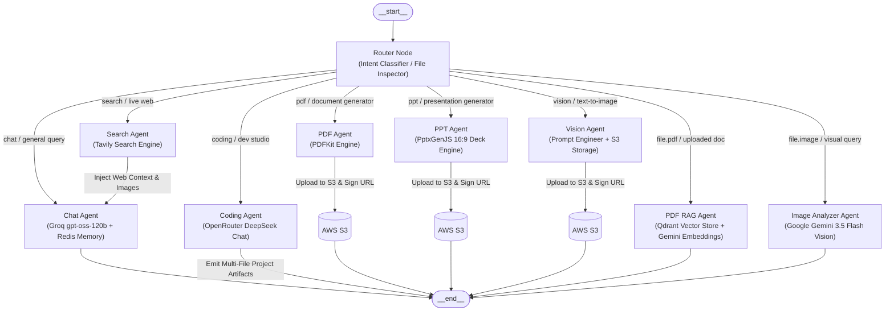
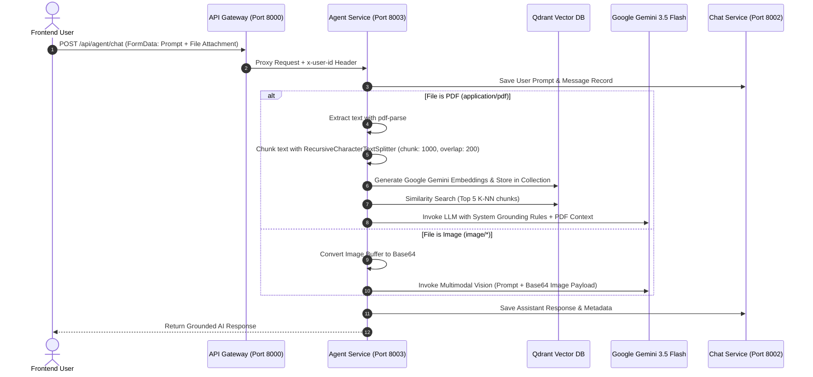

# 🧠 Omnix AI — Enterprise Multi-Agent AI Platform & Code Sandbox

<div align="center">

[](#)
[](#)
[](#)
[](#)
[](#)
[](#)
[](#)
[](#)
[](#)

<p align="center">
  <b>An enterprise-grade, distributed microservices AI workspace powered by LangGraph stateful orchestration, Qdrant Vector RAG, Google Gemini multimodal vision, interactive Monaco Editor sandboxes, AWS S3 asset delivery pipelines, Redis sliding-memory & rate-limiting, and Razorpay subscription billing.</b>
</p>
  
</div>

---

## 📑 Table of Contents

- [📌 Project Overview](#-project-overview)
- [🏗️ System Architecture](#️-system-architecture)
- [🤖 Multi-Agent Ecosystem (LangGraph)](#-multi-agent-ecosystem-langgraph)
- [🔍 Document RAG & Multimodal Vision Pipeline](#-document-rag--multimodal-vision-pipeline)
- [💻 Monaco Code Sandbox & Live Artifacts](#-monaco-code-sandbox--live-artifacts)
- [🛡️ Security, Sessions & Rate Limiting](#️-security-sessions--rate-limiting)
- [💳 Subscription Plans & Credit Economics](#-subscription-plans--credit-economics)
- [🚀 Tech Stack](#-tech-stack)
- [📂 Project Directory Layout](#-project-directory-layout)
- [🛠️ Getting Started & Installation](#️-getting-started--installation)
  - [Prerequisites](#prerequisites)
  - [1. Docker & Infrastructure Setup](#1-docker--infrastructure-setup)
  - [2. Environment Configuration](#2-environment-configuration)
  - [3. Running Services Locally](#3-running-services-locally)
- [📡 API Endpoints Reference](#-api-endpoints-reference)
- [🗺️ Product Roadmap](#️-product-roadmap)
- [📄 License & Authors](#-license--authors)

---

## 📌 Project Overview

**Omnix AI** is a distributed, full-stack multi-agent AI assistant and developer workspace designed to replace fragmented AI tools with an integrated execution environment. Rather than routing all prompts through a single generalized model, Omnix AI decomposes complex queries, file attachments, and coding tasks into autonomous, specialized agent nodes coordinated by **LangGraph**.

### 🌟 Core Capabilities

- **Unified Reverse-Proxy API Gateway:** Centralized routing with CORS management, HTTP-only cookie authentication, Redis session validation, and downstream authenticated identity injection (`x-user-id`).
- **Distributed Session Lifecycle:** Google OAuth authentication via Firebase Admin SDK with secure, 7-day TTL Redis session tokens and persistent client profile hydration.
- **Intelligent LangGraph Router:** Dynamically analyzes prompt intent and file payloads (`application/pdf`, `image/*`) to dispatch execution to dedicated autonomous agents.
- **Document RAG (Retrieval-Augmented Generation):** High-precision question answering over uploaded PDFs using `pdf-parse`, LangChain text splitters, Google GenAI embeddings (`gemini-embedding-001`), and Qdrant Vector Store similarity search.
- **Multimodal Visual Intelligence:** Visual reasoning, OCR text extraction, and chart/table interpretation on uploaded images powered by Google Gemini (`gemini-3.5-flash`).
- **Multi-File Interactive Code Artifacts:** Dual-stage coding agent that classifies intent and outputs complete frontend projects (`index.html`, `style.css`, `script.js`, Unsplash assets) directly into an integrated Microsoft Monaco Editor with live sandboxed preview.
- **On-Demand Document & Presentation Synthesis:** Generates styled PDF reports (`pdfkit`) and 16:9 widescreen presentations (`pptxgenjs`), persisting them to AWS S3 with secure 24-hour presigned download links.
- **Real-Time Web Intelligence:** Live internet and image search powered by the Tavily Search API, with search context automatically synthesized into conversational answers.
- **Distributed Memory & Sliding Rate Limiting:** 24-hour sliding memory buffers in Redis for conversational continuity, paired with per-user per-agent sliding-window rate limiters.
- **Credit-Based Subscription Engine:** Integrated Razorpay order management and SHA-256 HMAC verification supporting tiered plans (**Free**, **Starter**, **Pro**) with automatic credit deduction per agent execution.

---

## 🏗️ System Architecture

```mermaid
graph TD
    Client["Frontend Client\n(React 19 + Vite + Redux Toolkit + Monaco Editor + Tailwind CSS)"] -->|"HTTP / REST (Port 8000)"| Gateway["API Gateway (Express Reverse Proxy)"]

    Gateway -->|"/api/auth/*"| AuthService["Auth Service (Port 8001)"]
    Gateway -->|"/api/chat/* (Protected + x-user-id)"| ChatService["Chat Service (Port 8002)"]
    Gateway -->|"/api/agent/* (Protected + x-user-id)"| AgentService["Agent Service (Port 8003)"]
    Gateway -->|"/api/billing/* (Protected + x-user-id)"| BillingService["Billing Service (Port 8004)"]
    Gateway -->|"/api/me (Protected)"| GatewayAuth["Gateway Session Validator"]

    GatewayAuth -->|"Session Lookup (7d TTL)"| Redis[("Redis\n(Sessions, Memory & Rate Limits)")]

    AuthService -->|"Verify Google ID Token"| Firebase["Firebase Admin SDK"]
    AuthService -->|"User Persistence & Credits"| MongoDB[("MongoDB Atlas Database")]
    AuthService -->|"Store Session (7d TTL)"| Redis

    ChatService -->|"Conversations, Messages, Artifacts"| MongoDB

    AgentService -->|"Memory Buffer (24h TTL)"| Redis
    AgentService -->|"Agent Sliding Rate Limit"| Redis
    AgentService -->|"Deduct Credits"| AuthService
    AgentService -->|"Save User/Assistant Messages"| ChatService
    AgentService -->|"StateGraph Workflow"| LangGraph["LangGraph Multi-Agent Engine"]

    LangGraph -->|"Router Node"| LLM_Router["LLM Router (Groq: gpt-oss-120b)"]
    LangGraph -->|"Chat Agent"| LLM_Chat["Chat Agent (Groq + Redis Context)"]
    LangGraph -->|"Coding Agent"| LLM_Coding["Coding Agent (OpenRouter: DeepSeek Chat)"]
    LangGraph -->|"Search Agent"| TavilyAPI["Search Agent (Tavily Web & Images)"]
    LangGraph -->|"PDF Agent"| PDFKit["PDF Generator (PDFKit)"]
    LangGraph -->|"PPT Agent"| PPTXGen["Presentation Generator (PptxGenJS)"]
    LangGraph -->|"Vision Agent"| PollinationsAI["Text-to-Image (Pollinations AI)"]
    LangGraph -->|"PDF RAG Agent"| QdrantDB[("Qdrant Vector DB + Gemini Embeddings")]
    LangGraph -->|"Image Analyzer"| GeminiVision["Image Analyzer (Gemini 3.5 Flash Vision)"]

    PDFKit -->|"Upload Document Buffer"| S3[("AWS S3 Bucket\n(24h Presigned URLs)")]
    PPTXGen -->|"Upload Presentation Buffer"| S3
    PollinationsAI -->|"Upload PNG Buffer"| S3

    BillingService -->|"Create Orders & HMAC Verification"| Razorpay["Razorpay Payment Gateway"]
    BillingService -->|"Update User Plan & Credits"| AuthService
    BillingService -->|"Payment Transactions Log"| MongoDB
```



---

## 🤖 Multi-Agent Ecosystem (LangGraph)

The **Agent Microservice** orchestrates autonomous agents using `@langchain/langgraph`'s compiled `StateGraph`. Requests are classified either by explicit agent pills selected in the UI, uploaded file types, or via the Groq-powered Router node.



### 📋 Agent Node Specifications

| Agent | Trigger / Intent | Model / Engine | Cost | Rate Limit | Output Format |
| :--- | :--- | :--- | :---: | :---: | :--- |
| **Router** | Initial node for all requests | Groq (`openai/gpt-oss-120b`) | 0 | — | Directs graph to target agent node |
| **Chat** | General discussion, Q&A, reasoning | Groq (`openai/gpt-oss-120b`) + Redis Memory | 1 Credit | 20 req/min | Structured Markdown with Prism syntax code blocks |
| **Search** | Current events, news, internet lookup | `@langchain/tavily` (Tavily Search API) | 5 Credits | 5 req/min | Web search snippets & image grid piped to Chat |
| **Coding** | Code generation, debugging, review, optimization | OpenRouter (`deepseek/deepseek-chat`) | 10 Credits | 5 req/min | Multi-file JSON bundle (`index.html`, `style.css`, `script.js`) for Monaco Sandbox |
| **PDF** | Document generation & report synthesis | LLM Structure Engine + `pdfkit` + AWS S3 | 10 Credits | 5 req/min | Structured document + 24-hour presigned S3 download link |
| **PPT** | Presentation slide deck creation | LLM Structure Engine + `pptxgenjs` + AWS S3 | 10 Credits | 5 req/min | 16:9 `.pptx` deck + 24-hour presigned S3 download link |
| **Vision** | Text-to-image creation | LLM Prompt Engineer + Pollinations AI + S3 | 10 Credits | 3 req/min | 8K cinematic image preview + lightbox zoom + S3 download link |
| **PDF RAG** | Uploaded `.pdf` files | `pdf-parse` + `gemini-embedding-001` + Qdrant | 10 Credits | 5 req/min | Grounded answers strictly cited from uploaded document |
| **Image Analyzer**| Uploaded `image/*` files | Google Gemini (`gemini-3.5-flash`) Multimodal | 10 Credits | 3 req/min | Visual reasoning, OCR text extraction, chart/table breakdown |

---

## 🔍 Document RAG & Multimodal Vision Pipeline

Omnix AI features an integrated RAG and Vision ingestion pipeline for file attachments:



---

## 💻 Monaco Code Sandbox & Live Artifacts

When the **Coding Agent** receives a project generation prompt, it executes a two-phase pipeline:
1. **Intent Classification:** Classifies prompt into `CODE_GENERATION`, `CODE_REVIEW`, `DEBUGGING`, `OPTIMIZATION`, etc.
2. **Multi-File Generation:** For `CODE_GENERATION`, produces strict, validated JSON containing multi-file project specifications (`index.html`, `style.css`, `script.js`, and curated Unsplash imagery).

### Artifact Studio Features

- **Microsoft Monaco Editor:** Full VS Code editing experience with dark theme (`vs-dark`), line numbers, and syntax highlighting for 20+ languages.
- **Multi-File Tabs:** Seamless tab switching across HTML, CSS, JS, and project assets.
- **Live Sandboxed Preview:** Isolated iframe (`sandbox="allow-scripts"`) for instant execution and visual feedback.
- **Collapsible Responsive Drawer:** Expandable split-screen view on desktop, full-screen drawer on mobile, and one-click copy buttons with animated feedback.

---

## 🛡️ Security, Sessions & Rate Limiting

- **HTTP-Only Cookie Sessions:** Sessions are stored in Redis (`session:<sessionId>`) with a 7-day TTL and accessed via strict, secure HTTP-only cookies to eliminate XSS token theft.
- **Downstream Identity Injection:** The API Gateway validates Redis session tokens and decorates downstream microservice requests with the authenticated user ID (`x-user-id`), keeping downstream services stateless.
- **Per-Agent Sliding Rate Limiting:** Enforces independent per-user rate limit keys in Redis (`rate:<userId>:<agent>`) with 60-second sliding windows, returning precise retry timestamps (`retryAfter`) when limits are exceeded.
- **Payment Signature Verification:** Cryptographic HMAC SHA-256 verification of Razorpay signatures prevents fraudulent balance tampering.

---

## 💳 Subscription Plans & Credit Economics

Omnix AI uses a transparent credit economy backed by Razorpay payments:

| Plan | Price | Monthly Credits | Active Features |
| :--- | :---: | :---: | :--- |
| **Free** | ₹0 | 100 Credits | Auto, Chat, and Search agents |
| **Starter** | ₹199 | 500 Credits | Full access to Coding, PDF, PPT, and PDF RAG agents |
| **Pro** | ₹499 | 1,000 Credits | Priority queue, Vision generator, Image Analyzer, unlimited artifacts |

### Credit Deduction Schedule

- 💬 **Chat Query:** `1 Credit`
- 🌐 **Web Search Query:** `5 Credits`
- 💻 **Coding Studio Project:** `10 Credits`
- 📄 **PDF Synthesis / PDF RAG:** `10 Credits`
- 📊 **PowerPoint Presentation:** `10 Credits`
- 🎨 **Vision Generation / Image Analyzer:** `10 Credits`

---

## 🚀 Tech Stack

### **Frontend Client**
- **Framework:** [React 19](https://react.dev/) + [Vite](https://vitejs.dev/)
- **State Management:** [Redux Toolkit](https://redux-toolkit.js.org/) + [React Redux](https://react-redux.js.org/)
- **Code Editor:** [@monaco-editor/react](https://github.com/suren-atoyan/monaco-react) (Monaco Editor)
- **Styling:** [Tailwind CSS v4](https://tailwindcss.com/)
- **Icons & UI:** [Lucide React](https://lucide.dev/), [React Icons](https://react-icons.github.io/react-icons/)
- **Animations:** [Motion (Framer Motion)](https://motion.dev/)
- **Markdown & Code Highlighting:** `react-markdown`, `remark-gfm`, `react-syntax-highlighter` (Prism One Dark)
- **Authentication:** [Firebase Client SDK](https://firebase.google.com/) (Google OAuth Popup)
- **HTTP Client:** [Axios](https://axios-http.com/) (with cross-origin cookie credentials)

### **Backend Microservices**
- **Runtime:** [Node.js](https://nodejs.org/) (ES Modules)
- **Web Framework:** [Express.js](https://expressjs.com/) (Express v5)
- **API Gateway:** Reverse proxy routing via `express-http-proxy` with `proxyWithHeader` identity decorator
- **Multi-Agent Orchestration:** [LangGraph](https://langchain-ai.github.io/langgraphjs/) (`@langchain/langgraph`), `@langchain/core`
- **LLM Integrations:** `@langchain/groq`, `@langchain/google-genai`, `@langchain/openrouter`
- **Vector Database & Embeddings:** [Qdrant](https://qdrant.tech/) (`@langchain/qdrant`), Google GenAI Embeddings (`gemini-embedding-001`)
- **Document & Presentation Engines:** `pdf-parse` (PDF extraction), `pdfkit` (PDF synthesis), `pptxgenjs` (PowerPoint deck creation)
- **Web Search Engine:** `@langchain/tavily` (Tavily Search API)
- **Cloud Object Storage:** AWS SDK for JavaScript v3 (`@aws-sdk/client-s3`, `@aws-sdk/s3-request-presigner`)
- **Payments & Billing:** [Razorpay](https://razorpay.com/) Node SDK (`razorpay`), Node Crypto (SHA-256 HMAC)
- **Databases & Caching:** [MongoDB Atlas](https://www.mongodb.com/) via [Mongoose](https://mongoosejs.com/), [Redis](https://redis.io/) via `ioredis`
- **File Ingestion:** `multer` (multipart/form-data upload handler with 20MB limit)

---

## 📂 Project Directory Layout

```text
Omnix_AI/
├── backend/
│   ├── docker-compose.yml              # Redis container setup (Port 6379)
│   ├── package.json
│   ├── gateway/                        # Central API Gateway (Port 8000)
│   │   ├── controllers/
│   │   │   └── user.controller.js      # Session profile controller (/api/me)
│   │   ├── middleware/
│   │   │   └── auth.middleware.js      # Redis session validation (protect)
│   │   ├── utils/
│   │   │   └── proxyWithHeader.js      # Downstream x-user-id identity injection
│   │   ├── index.js                    # Gateway entry & reverse proxy routing
│   │   └── package.json
│   ├── services/
│   │   ├── auth/                       # Auth Microservice (Port 8001)
│   │   │   ├── config/                 # MongoDB & Firebase Admin initialization
│   │   │   ├── controllers/            # Google OAuth, session creation, credit updates
│   │   │   ├── models/                 # User Mongoose Schema
│   │   │   ├── routes/                 # Auth routes (/login, /logout, /deduct-credits)
│   │   │   ├── serviceAccountKey.json  # Firebase Admin credentials
│   │   │   └── index.js
│   │   ├── chat/                       # Chat & Thread Microservice (Port 8002)
│   │   │   ├── config/                 # MongoDB connection
│   │   │   ├── controllers/            # Conversation & Message CRUD
│   │   │   ├── models/                 # Conversation & Message Schemas
│   │   │   ├── routes/                 # Chat routes (/create, /update, /messages)
│   │   │   └── index.js
│   │   ├── agent/                      # Multi-Agent Microservice (Port 8003)
│   │   │   ├── agents/                 # Specialized agent node implementations
│   │   │   │   ├── chat.agent.js       # Groq conversational agent with memory
│   │   │   │   ├── coding.agent.js     # DeepSeek multi-file project generator
│   │   │   │   ├── imageAnalyzer.agent.js # Gemini 3.5 Flash multimodal vision
│   │   │   │   ├── pdf.agent.js        # PDFKit document generator + S3 upload
│   │   │   │   ├── pdfRag.agent.js     # Qdrant + Gemini embeddings PDF RAG
│   │   │   │   ├── ppt.agent.js        # PptxGenJS 16:9 presentation generator
│   │   │   │   ├── search.agent.js     # Tavily live web & image search agent
│   │   │   │   └── vision.agent.js     # Text-to-image prompt engineer + S3 upload
│   │   │   ├── config/                 # Config & clients
│   │   │   │   ├── agentLimit.js       # Sliding-window rate limiter in Redis
│   │   │   │   ├── db.js               # MongoDB connection
│   │   │   │   ├── embeddings.js       # Google GenAI embeddings client
│   │   │   │   ├── llmModels.js        # Groq, Gemini & OpenRouter model registry
│   │   │   │   ├── memory.js           # Redis sliding memory buffer (24h TTL)
│   │   │   │   ├── multer.js           # File upload middleware (PDF & Images)
│   │   │   │   ├── s3.js               # AWS S3 client configuration
│   │   │   │   ├── tavily.js           # Tavily search tool instance
│   │   │   │   └── vectorDb.js         # Qdrant vector store factory
│   │   │   ├── controllers/            # Agent controller (invokes LangGraph)
│   │   │   ├── graph/                  # LangGraph State Machine
│   │   │   │   ├── graph.js            # StateGraph definition & conditional edges
│   │   │   │   ├── router.js           # Intent & file payload classifier
│   │   │   │   └── state.js            # LangGraph state schema definition
│   │   │   ├── routes/                 # Agent routes (/chat with Multer)
│   │   │   ├── temp/                   # Temporary upload buffer directory
│   │   │   ├── utils/                  # Document generation & cloud storage helpers
│   │   │   │   ├── GeneratePdf.js      # PDFKit layout & styling engine
│   │   │   │   ├── deductCredits.js    # Credit deduction client
│   │   │   │   ├── generatePpt.js      # PptxGenJS slide layout builder
│   │   │   │   ├── getFromS3.js        # AWS S3 presigned URL generator
│   │   │   │   ├── getMessages.js      # Chat service message fetch utility
│   │   │   │   └── uploadToS3.js       # S3 buffer upload utility
│   │   │   └── index.js
│   │   └── billing/                    # Billing & Subscription Microservice (Port 8004)
│   │       ├── config/                 # Razorpay client & Plans configuration
│   │       ├── controllers/            # Order creation & SHA256 HMAC verification
│   │       ├── models/                 # Payment Mongoose Schema
│   │       ├── routes/                 # Billing routes (/create, /verify)
│   │       └── index.js
│   └── shared/
│       └── redis/
│           └── redis.js                # Shared ioredis singleton instance
├── frontend/                           # React 19 + Vite Frontend Client
│   ├── src/
│   │   ├── components/
│   │   │   ├── Artifact.jsx            # Monaco Editor & live iframe sandbox
│   │   │   ├── BillingDrawer.jsx       # Pricing plans, credit meter & Razorpay modal
│   │   │   ├── ChatArea.jsx            # Main chat container & scroll viewport
│   │   │   ├── ChatInput.jsx           # Input area, file attachments & agent pills
│   │   │   ├── LoadingAnimation.jsx    # Pulsing agent status indicators
│   │   │   ├── MessageBubble.jsx       # Markdown renderer, Prism code block & lightbox
│   │   │   ├── MessageList.jsx         # Message feed & prompt starters
│   │   │   ├── Nav.jsx                 # Top header & active conversation title
│   │   │   └── SideBar.jsx             # Thread sidebar, credit display & user profile
│   │   ├── features/                   # Axios API service action helpers
│   │   ├── pages/
│   │   │   └── Home.jsx                # Main layout shell & Google OAuth modal
│   │   ├── redux/                      # Redux Toolkit state slices & store
│   │   │   ├── conversationSlice.js    # Conversation list & active selection
│   │   │   ├── messageSlice.js         # Messages array, artifacts & loading state
│   │   │   ├── userSlice.js            # User profile, credits & active plan
│   │   │   └── store.js                # Configured Redux store
│   │   ├── utils/                      # Axios client instance & Firebase config
│   │   ├── App.jsx
│   │   └── main.jsx
│   └── package.json
└── README.md
```

---

## 🛠️ Getting Started & Installation

### Prerequisites

Ensure you have the following installed:
- [Node.js (v18+)](https://nodejs.org/) and [npm](https://www.npmjs.com/)
- [Docker & Docker Desktop](https://www.docker.com/) (for Redis)
- [MongoDB Atlas](https://www.mongodb.com/) cluster or local MongoDB instance
- [Qdrant Cloud](https://qdrant.tech/) cluster or local Qdrant instance
- [Firebase Project](https://console.firebase.google.com/) with Google Sign-In & Service Account Key
- API Keys:
  - [Groq API Key](https://console.groq.com/)
  - [Google AI Studio API Key](https://aistudio.google.com/)
  - [OpenRouter API Key](https://openrouter.ai/)
  - [Tavily Search API Key](https://tavily.com/)
  - [AWS S3 Bucket](https://aws.amazon.com/s3/) (Access Key, Secret Key, Region, Bucket Name)
  - [Razorpay Account](https://razorpay.com/) (Key ID & Key Secret)

---

### 1. Docker & Infrastructure Setup

From the `backend` directory, launch the Redis container:

```bash
cd backend
docker compose up -d
```

Verify Redis is running on port `6379`:
```bash
docker ps
```

---

### 2. Environment Configuration

Create `.env` configuration files for each service:

#### 🔹 1. API Gateway (`backend/gateway/.env`)
```env
PORT=8000
FRONTEND_URL=http://localhost:5173
AUTH_SERVICE=http://localhost:8001
CHAT_SERVICE=http://localhost:8002
AGENT_SERVICE=http://localhost:8003
BILLING_SERVICE=http://localhost:8004
REDIS_URL=redis://localhost:6379
```

#### 🔹 2. Auth Service (`backend/services/auth/.env`)
```env
PORT=8001
MONGO_URI=mongodb+srv://<username>:<password>@cluster.mongodb.net/omnix_auth?retryWrites=true&w=majority
REDIS_URL=redis://localhost:6379
```
> **Firebase Credentials:** Place your Firebase Admin Service Account Key JSON at:  
> `backend/services/auth/serviceAccountKey.json`

#### 🔹 3. Chat Service (`backend/services/chat/.env`)
```env
PORT=8002
MONGO_URI=mongodb+srv://<username>:<password>@cluster.mongodb.net/omnix_chat?retryWrites=true&w=majority
```

#### 🔹 4. Agent Service (`backend/services/agent/.env`)
```env
PORT=8003
MONGO_URI=mongodb+srv://<username>:<password>@cluster.mongodb.net/omnix_agent?retryWrites=true&w=majority
CHAT_SERVICE=http://localhost:8002
AUTH_SERVICE=http://localhost:8001
REDIS_URL=redis://localhost:6379

# AI & Search API Keys
GROQ_API_KEY=your_groq_api_key
GOOGLE_API_KEY=your_google_gemini_api_key
OPENROUTER_API_KEY=your_openrouter_api_key
TAVILY_API_KEY=your_tavily_api_key

# Vector Database (Qdrant)
QDRANT_URL=https://your-cluster.qdrant.tech:6333
QDRANT_API_KEY=your_qdrant_api_key

# AWS S3 Storage
AWS_REGION=us-east-1
AWS_ACCESS_KEY_ID=your_aws_access_key
AWS_SECRET_KEY=your_aws_secret_key
AWS_BUCKET_NAME=your_s3_bucket_name
```

#### 🔹 5. Billing Service (`backend/services/billing/.env`)
```env
PORT=8004
MONGO_URI=mongodb+srv://<username>:<password>@cluster.mongodb.net/omnix_billing?retryWrites=true&w=majority
AUTH_SERVICE=http://localhost:8001
RAZORPAY_KEY_ID=rzp_test_your_key_id
RAZORPAY_KEY_SECRET=your_razorpay_secret
```

#### 🔹 6. Frontend Client (`frontend/.env`)
```env
VITE_SERVER_URL=http://localhost:8000
VITE_RAZORPAY_KEY_ID=rzp_test_your_key_id

# Firebase Client Configuration
VITE_FIREBASE_API_KEY=your_firebase_api_key
VITE_FIREBASE_AUTH_DOMAIN=your_project.firebaseapp.com
VITE_FIREBASE_PROJECT_ID=your_project_id
VITE_FIREBASE_STORAGE_BUCKET=your_project.appspot.com
VITE_FIREBASE_MESSAGING_SENDER_ID=your_sender_id
VITE_FIREBASE_APP_ID=your_app_id
```

---

### 3. Running Services Locally

Start the microservices in separate terminal windows:

```bash
# Terminal 1: Redis Container
cd backend
docker compose up -d

# Terminal 2: API Gateway (Port 8000)
cd backend/gateway
npm install
npm run dev

# Terminal 3: Auth Service (Port 8001)
cd backend/services/auth
npm install
npm run dev

# Terminal 4: Chat Service (Port 8002)
cd backend/services/chat
npm install
npm run dev

# Terminal 5: Agent Service (Port 8003)
cd backend/services/agent
npm install
npm run dev

# Terminal 6: Billing Service (Port 8004)
cd backend/services/billing
npm install
npm run dev

# Terminal 7: Frontend Client (Port 5173)
cd frontend
npm install
npm run dev
```

Visit **`http://localhost:5173`** in your browser to launch the Omnix AI workspace.

---

## 📡 API Endpoints Reference

### **1. Gateway & Authentication (`/api/auth`)**

| Method | Endpoint | Description | Auth Required |
| :--- | :--- | :--- | :---: |
| `GET` | `/` | Gateway health check | ❌ |
| `GET` | `/api/me` | Validates Redis session and returns profile, plan, and credit balance | ✅ (Cookie) |
| `POST` | `/api/auth/login` | Verifies Firebase ID token, creates/finds MongoDB user, issues 7-day Redis session cookie | ❌ |
| `GET` | `/api/auth/logout` | Clears Redis session key and wipes session cookie | ✅ (Cookie) |
| `POST` | `/api/auth/update-plan` | Internal service endpoint: updates user subscription tier and adds credits | Internal |
| `POST` | `/api/auth/deduct-credits` | Internal service endpoint: validates and deducts credits per agent action | Internal |

### **2. Chat Management (`/api/chat`)**
*(Proxied through Gateway with authenticated `x-user-id` header injection)*

| Method | Endpoint | Description | Auth Required |
| :--- | :--- | :--- | :---: |
| `GET` | `/api/chat/create-conversation` | Creates a new conversation thread for the user | ✅ |
| `GET` | `/api/chat/get-conversations` | Fetches all conversations belonging to the user (sorted newest-first) | ✅ |
| `POST` | `/api/chat/update-conversation` | Updates conversation title (`{ id, title }`) | ✅ |
| `POST` | `/api/chat/save-message` | Persists a message record (`{ conversationId, role, content, images, artifacts }`) | ✅ |
| `GET` | `/api/chat/get-messages/:conversationId` | Fetches complete message history for a conversation thread | ✅ |

### **3. Multi-Agent Orchestration (`/api/agent`)**
*(Proxied through Gateway with `multipart/form-data` support)*

| Method | Endpoint | Description | Auth Required |
| :--- | :--- | :--- | :---: |
| `POST` | `/api/agent/chat` | Receives prompt, agent override, and optional file (`file`); executes LangGraph workflow; updates Redis memory; returns response, images, and code artifacts | ✅ |

### **4. Billing & Subscription Management (`/api/billing`)**
*(Proxied through Gateway with authenticated `x-user-id` header injection)*

| Method | Endpoint | Description | Auth Required |
| :--- | :--- | :--- | :---: |
| `POST` | `/api/billing/create` | Creates a Razorpay order for the selected plan (`{ plan }`) and stores pending payment record | ✅ |
| `POST` | `/api/billing/verify` | Verifies SHA-256 HMAC signature, updates payment status to `paid`, and adds credits | ✅ |

---

## 🗺️ Product Roadmap

- [x] Multi-agent routing with LangGraph state machine.
- [x] Interactive Monaco Editor code sandbox with live iframe preview.
- [x] Document synthesis (PDFs with PDFKit, Presentations with PptxGenJS) & AWS S3 cloud delivery.
- [x] Text-to-image synthesis with Pollinations AI and AWS S3 storage.
- [x] Qdrant Vector RAG with Google GenAI embeddings for document question answering.
- [x] Google Gemini 3.5 Flash multimodal vision analysis for images.
- [x] Redis sliding conversational memory and per-agent sliding rate limiters.
- [x] Razorpay subscription billing with credit balances.
- [ ] **Token-by-Token Streaming:** Server-Sent Events (SSE) / WebSockets for typewriter-style streaming responses from LangGraph to the frontend.
- [ ] **Voice-to-Text & Speech Synthesis:** Web Speech API / Whisper transcription with audio playback.
- [ ] **Docker Compose Root Orchestrator:** Single command root `docker-compose.yml` to launch all 5 microservices, Redis, and Vite frontend.
- [ ] **Export & Share Sandbox:** One-click deployment of Monaco code artifacts to CodeSandbox / GitHub Gists.

---

## 📄 License & Authors

Developed by **Omnix AI Team**.  
Licensed for development, educational, and commercial evaluation purposes.
