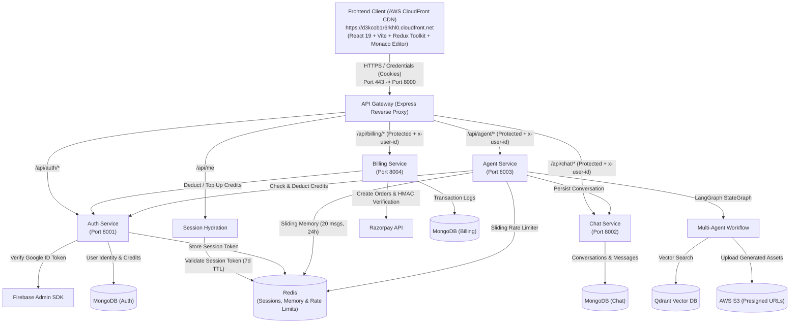
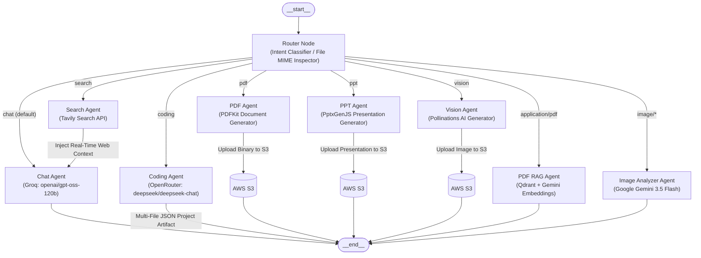

# 🧠 Omnix AI

<div align="center">

[](https://d3kcob1r6rkhl0.cloudfront.net)
[](https://react.dev/)
[](https://vitejs.dev/)
[](https://langchain.com/)
[](https://expressjs.com/)
[](https://redis.io/)
[](https://mongodb.com/)
[](https://www.docker.com/)

**An enterprise-grade, distributed multi-agent AI assistant and interactive developer workspace.**  
Orchestrated with **LangGraph**, Omnix AI delivers multi-file code generation with live Monaco Editor sandboxing, document synthesis (PDF & PPT), multimodal image analysis, vector-based PDF RAG, real-time speech recognition, live web search, and credit-based subscription billing.

[🚀 Explore Live Application](https://d3kcob1r6rkhl0.cloudfront.net) • [🏗️ System Architecture](#-system-architecture) • [🤖 Multi-Agent Workflow](#-multi-agent-orchestration-langgraph) • [🐳 Docker & Local Setup](#-getting-started--local-setup) • [📡 API Reference](#-api-reference)

</div>

---

## 🌐 Live AWS Deployment

The Omnix AI production frontend is deployed globally on **AWS CloudFront** edge infrastructure backed by **AWS S3**:

- 🔗 **Production URL:** [https://d3kcob1r6rkhl0.cloudfront.net](https://d3kcob1r6rkhl0.cloudfront.net)
- 🔒 **Edge Security:** Global SSL/TLS termination, HTTP-only cross-origin sessions (`SameSite=None`, `Secure=true`), and CORS-protected API Gateway proxy routing.
- 📦 **Artifact Delivery:** High-speed cloud asset streaming with AWS S3 presigned URLs (24-hour expiration) for synthesized PDFs, PowerPoint decks, and AI-generated imagery.

---

## 📑 Table of Contents

- [Live AWS Deployment](#-live-aws-deployment)
- [Key Features](#-key-features)
- [System Architecture](#-system-architecture)
- [Multi-Agent Orchestration (LangGraph)](#-multi-agent-orchestration-langgraph)
  - [Agent Routing & Execution Matrix](#agent-routing--execution-matrix)
- [Microservices Overview](#-microservices-overview)
  - [1. API Gateway (Port 8000)](#1-api-gateway-port-8000)
  - [2. Auth Service (Port 8001)](#2-auth-service-port-8001)
  - [3. Chat Service (Port 8002)](#3-chat-service-port-8002)
  - [4. Agent Service (Port 8003)](#4-agent-service-port-8003)
  - [5. Billing Service (Port 8004)](#5-billing-service-port-8004)
- [Specialized Capabilities](#-specialized-capabilities)
  - [🎙️ Real-Time Speech-to-Text Recognition](#-real-time-speech-to-text-recognition)
  - [💻 Multi-File Code Sandbox & Monaco Editor](#-multi-file-code-sandbox--monaco-editor)
  - [📄 Document RAG Pipeline (Qdrant + Gemini Embeddings)](#-document-rag-pipeline-qdrant--gemini-embeddings)
  - [👁️ Multimodal Vision & Image Analysis](#️-multimodal-vision--image-analysis)
  - [📊 Document & Presentation Synthesis (PDF & PPT)](#-document--presentation-synthesis-pdf--ppt)
  - [🌐 Live Web Intelligence (Tavily)](#-live-web-intelligence-tavily)
- [Session Management, Security & Rate Limiting](#-session-management-security--rate-limiting)
- [Billing, Plans & Credit Economics](#-billing-plans--credit-economics)
- [Tech Stack](#-tech-stack)
- [Repository Structure](#-repository-structure)
- [Getting Started & Local Setup](#-getting-started--local-setup)
  - [Prerequisites](#prerequisites)
  - [Option A: Running with Docker](#option-a-running-with-docker)
  - [Option B: Manual Local Setup](#option-b-manual-local-setup)
  - [Environment Variables Configuration](#environment-variables-configuration)
- [AWS Cloud Deployment Guide](#-aws-cloud-deployment-guide)
- [API Reference](#-api-reference)
- [License](#-license)

---

## ✨ Key Features

- 🎙️ **Voice-First Interaction:** Integrated Web Speech API enables real-time, continuous microphone dictation with live interim transcription directly into the prompt bar.
- 🤖 **Autonomous Multi-Agent Router:** Dynamic intent classification and MIME-type detection route incoming queries to the optimal specialized LLM node.
- 💻 **Live Monaco Code Studio:** Synthesizes multi-file frontend projects (`index.html`, `style.css`, `script.js`) with an interactive Monaco Editor (`vs-dark`) and hot-reloading sandboxed `<iframe>`.
- 🔍 **Vector-Powered PDF RAG:** Extracts text from uploaded documents, splits chunks via LangChain, indexes vectors into Qdrant, and performs semantic similarity retrieval with Google Gemini Embeddings.
- 👁️ **Multimodal Reasoning:** Direct image analysis, OCR, and diagram decoding via Google Gemini 3.5 Flash.
- 📑 **Instant Document & Slide Generation:** Compiles publication-ready multi-page PDFs (`pdfkit`) and 16:9 widescreen PowerPoint decks (`pptxgenjs`), uploaded directly to AWS S3.
- 🌐 **Grounded Web Search:** Tavily Search API extracts real-time web intelligence and injects snippets and images directly into conversation threads.
- 🧠 **Dual Memory Architecture:** High-speed sliding memory window in Redis (last 20 messages, 24h TTL) combined with persistent MongoDB conversation thread history.
- 🛡️ **Sliding Window Rate Limiter:** Per-user, per-agent request throttling enforced via Redis with exact retry timestamps (`retryAfter`).
- 💳 **Production Credit Economy:** Multi-tier subscriptions backed by Razorpay payments and cryptographic HMAC SHA-256 signature verification.
- 🐳 **Containerized Microservices:** Dockerfiles provided for all services alongside Docker Compose for scalable deployments.

---

## 🏗️ System Architecture

Omnix AI is architected as decoupled microservices connected through an Express API Gateway. Downstream services communicate privately over internal networks and authenticate requests via `x-user-id` header injection.



---

## 🤖 Multi-Agent Orchestration (LangGraph)

The **Agent Service** coordinates specialized tasks using a compiled `@langchain/langgraph` `StateGraph`. Incoming user requests pass through an intelligent router that evaluates agent overrides, uploaded file MIME types, or LLM intent classification.



### Agent Routing & Execution Matrix

| Agent | Trigger Condition | Model / Tool Engine | Output Format | Cost | Rate Limit |
| :--- | :--- | :--- | :--- | :---: | :---: |
| **Router** | Initial workflow entry node | Groq (`openai/gpt-oss-120b`) / MIME inspection | Next graph node identifier | 0 Credits | — |
| **Chat** | Conversational Q&A, general inquiries | Groq (`openai/gpt-oss-120b`) + Redis memory | Markdown with code blocks | 1 Credit | 20 req/min |
| **Search** | Real-time events, internet queries | Tavily Search API (`@langchain/tavily`) | Web snippets & images piped into Chat | 5 Credits | 5 req/min |
| **Coding** | Software engineering, code generation | OpenRouter (`deepseek/deepseek-chat`) | Multi-file JSON bundle (`index.html`, `style.css`, `script.js`) | 10 Credits | 5 req/min |
| **PDF** | Document synthesis, report generation | Groq + `pdfkit` + AWS S3 | Styled PDF + 24h presigned URL | 10 Credits | 5 req/min |
| **PPT** | Presentation deck requests | Groq + `pptxgenjs` + AWS S3 | 6-slide 16:9 PPTX + 24h presigned URL | 10 Credits | 5 req/min |
| **Vision** | Text-to-image synthesis | Groq Prompt Engine + Pollinations AI + S3 | PNG binary + 24h presigned URL | 10 Credits | 3 req/min |
| **PDF RAG** | Uploaded `.pdf` files | `pdf-parse` + Gemini Embeddings + Qdrant | Citations & grounded document Q&A | 10 Credits | 5 req/min |
| **Image Analyzer** | Uploaded `image/*` files | Google Gemini (`gemini-3.5-flash`) Multimodal | Visual reasoning & OCR breakdown | 10 Credits | 3 req/min |

---

## 🧩 Microservices Overview

### 1. API Gateway (Port 8000)
- **Central Reverse Proxy:** Unifies all frontend requests using `express-http-proxy`.
- **Session Authentication:** Validates HTTP-only `session` cookie against Redis (`session:<sessionId>`).
- **Identity Injection:** Injects verified user ID into downstream requests via `x-user-id` header.
- **CORS & Credentials:** Supports secure cross-origin requests from the CloudFront client with cookie credentials.
- **Session Endpoint:** Exposes `GET /api/me` for seamless client-side user hydration.

### 2. Auth Service (Port 8001)
- **Identity Provider:** Verifies Google OAuth ID tokens via Firebase Admin SDK.
- **User Persistence:** Manages user records, credit balances, and subscription tiers in MongoDB.
- **Session Lifecycle:** Issues secure UUID session tokens stored in Redis with 7-day TTL.
- **Credit Operations:** Handles internal atomic credit top-ups (`/update-plan`) and deductions (`/deduct-credits`).

### 3. Chat Service (Port 8002)
- **Conversation State:** Persists threads and messages in MongoDB.
- **Rich Message Schema:** Supports message text, image attachments, and structured artifact payloads.
- **Thread Management:** Provides endpoints to create threads, list user conversations, update titles, and load message history.

### 4. Agent Service (Port 8003)
- **LangGraph Execution:** Executes compiled state graphs for specialized autonomous agents.
- **Sliding Memory:** Maintains dynamic short-term conversation context in Redis (last 20 messages, 24h TTL).
- **Rate Throttling:** Enforces per-user, per-agent sliding window rate limiters in Redis (60-second window).
- **Document & Vector Processing:** Handles PDF text extraction, Qdrant vector indexing, and S3 artifact storage.

### 5. Billing Service (Port 8004)
- **Razorpay Orders:** Generates payment orders for subscription tiers (Starter, Pro).
- **Cryptographic Verification:** Verifies payment authenticity using SHA-256 HMAC signatures.
- **Fulfillment:** Logs transactions in MongoDB and notifies the Auth Service to credit the user's account.

---

## ⚡ Specialized Capabilities

### 🎙️ Real-Time Speech-to-Text Recognition
- Omnix AI features hands-free voice dictation powered by the browser's native **Web Speech API** (`SpeechRecognition` / `webkitSpeechRecognition`).
- Features continuous listening mode (`continuous = true`), real-time interim results (`interimResults = true`), and dynamic visual state cues (`Mic` / `MicOff`).
- Live voice input updates the chat bar instantaneously, enabling natural hands-free prompting.

### 💻 Multi-File Code Sandbox & Monaco Editor
- When the **Coding Agent** receives a code prompt, it generates complete multi-file project structures (`index.html`, `style.css`, and `script.js`).
- The frontend loads the project into **Microsoft Monaco Editor** (`vs-dark` theme) with multi-tab switching and real-time syntax highlighting.
- An interactive **`<iframe>` sandbox** renders the live project with hot reloading, allowing users to preview and test their web applications instantly.

### 📄 Document RAG Pipeline (Qdrant + Gemini Embeddings)
1. **Extraction:** Uploaded `.pdf` files are parsed into raw text buffers using `pdf-parse`.
2. **Chunking:** Documents are split into semantic blocks via `RecursiveCharacterTextSplitter` (1,000 characters, 200 overlap).
3. **Embeddings:** Chunks are vectorized using `gemini-embedding-001` (`GoogleGenerativeAIEmbeddings`).
4. **Vector Store:** Embeddings are dynamically indexed into isolated collections in **Qdrant**.
5. **Retrieval:** Semantic similarity queries fetch the top 5 chunks to produce factually grounded citations.

### 👁️ Multimodal Vision & Image Analysis
- Accepts image uploads (`image/png`, `image/jpeg`, `image/webp`).
- Converts buffers into Base64 formats for processing with **Google Gemini 3.5 Flash**.
- Performs visual question answering, OCR extraction, diagram analysis, and code generation from mockups.

### 📊 Document & Presentation Synthesis (PDF & PPT)
- **PDF Generation:** Compiles structured agent output into styled multi-page PDF documents using `pdfkit`. Uploads binaries to AWS S3 and returns secure 24-hour presigned download links.
- **PowerPoint Decks:** Generates complete 6-slide 16:9 presentation decks with headers, bullet points, and themes using `pptxgenjs`, uploaded to AWS S3.

### 🌐 Live Web Intelligence (Tavily)
- Queries requiring real-time knowledge invoke the **Tavily Search API**.
- Live snippets and imagery are injected directly into the Chat Agent's context window, allowing Omnix AI to provide up-to-the-minute answers.

---

## 🛡️ Session Management, Security & Rate Limiting

- **HTTP-Only Cookies:** Sessions are stored in Redis (`session:<sessionId>`) with a 7-day TTL and delivered via HTTP-only cookies (`SameSite=None`, `Secure=true`) to guard against XSS vulnerabilities.
- **Reverse Proxy Protection:** The API Gateway validates incoming sessions before proxying requests and injects the authenticated `x-user-id` header.
- **Per-Agent Sliding Rate Limiter:** Enforces Redis sliding windows (`rate:<userId>:<agent>`) over 60-second intervals. If limits are reached, responses return a human-readable `retryAfter` timestamp.
- **HMAC SHA-256 Payment Verification:** Razorpay payment callbacks verify signatures against the merchant secret before updating account credits.

---

## 💳 Billing, Plans & Credit Economics

| Plan | Price | Monthly Credits | Duration | Features |
| :--- | :---: | :---: | :---: | :--- |
| **Free** | ₹0 | 100 Credits | 30 Days | Access to all agents, standard rate limits |
| **Starter** | ₹199 | 500 Credits | 30 Days | Higher rate limits, priority generation |
| **Pro** | ₹499 | 1,000 Credits | 30 Days | Maximum rate limits, dedicated support |

### Credit Deduction Rules

- 💬 **Chat Agent:** `1 Credit`
- 🌐 **Web Search Agent:** `5 Credits`
- 💻 **Coding Studio Agent:** `10 Credits`
- 📄 **PDF Synthesis / PDF RAG:** `10 Credits`
- 📊 **PowerPoint Deck Generation:** `10 Credits`
- 🎨 **Vision Image Generation / Image Analyzer:** `10 Credits`

---

## 🚀 Tech Stack

### Frontend Client
- **Framework:** React 19 + Vite 8
- **Styling:** Tailwind CSS v4
- **State Management:** Redux Toolkit + React Redux
- **Code Editor:** `@monaco-editor/react` (Microsoft Monaco Editor)
- **Animations:** Motion (Framer Motion)
- **Icons:** Lucide React, React Icons
- **Markdown & Code Highlighting:** `react-markdown`, `remark-gfm`, `react-syntax-highlighter` (Prism)
- **Authentication:** Firebase Client SDK (Google OAuth)
- **Speech Recognition:** Web Speech API (`webkitSpeechRecognition`)
- **HTTP Client:** Axios (with credentials)

### Backend Microservices
- **Runtime:** Node.js (ES Modules)
- **Web Framework:** Express.js 5
- **API Gateway:** `express-http-proxy`, `cors`, `cookie-parser`
- **Agent Orchestration:** LangGraph (`@langchain/langgraph`), `@langchain/core`
- **LLM Integrations:** `@langchain/groq`, `@langchain/google-genai`, `@langchain/openrouter`
- **Vector Database:** Qdrant (`@langchain/qdrant`), Google GenAI Embeddings (`gemini-embedding-001`)
- **Document & Presentation:** `pdfkit`, `pptxgenjs`, `pdf-parse`
- **Search API:** `@langchain/tavily`
- **Cloud Storage:** AWS SDK for JavaScript v3 (`@aws-sdk/client-s3`, `@aws-sdk/s3-request-presigner`)
- **Payment Gateway:** Razorpay SDK (`razorpay`) + Crypto HMAC SHA-256
- **Database & Cache:** MongoDB Atlas via Mongoose 9, Redis via `ioredis`
- **Containerization:** Docker & Docker Compose

---

## 📂 Repository Structure

```text
Omnix_AI/
├── backend/
│   ├── docker-compose.yml              # Local container orchestration (Redis, services)
│   ├── package.json                    # Backend shared dependencies (ioredis)
│   ├── shared/
│   │   └── redis/
│   │       └── redis.js                # Shared ioredis client singleton
│   ├── gateway/                        # API Gateway (Port 8000)
│   │   ├── Dockerfile                  # Gateway container definition
│   │   ├── .dockerignore
│   │   ├── controllers/
│   │   │   └── user.controller.js      # Session profile handler (/api/me)
│   │   ├── middleware/
│   │   │   └── auth.middleware.js      # Redis session validation (protect)
│   │   ├── utils/
│   │   │   └── proxyWithHeader.js      # Downstream x-user-id header decorator
│   │   ├── index.js                    # Gateway entry & reverse proxy routing
│   │   └── package.json
│   └── services/
│       ├── auth/                       # Auth Microservice (Port 8001)
│       │   ├── Dockerfile              # Auth container definition
│       │   ├── .dockerignore
│       │   ├── config/                 # MongoDB & Firebase Admin initialization
│       │   ├── controllers/            # Login, logout, credit operations
│       │   ├── models/                 # User Mongoose model
│       │   ├── routes/                 # Auth routes (/login, /logout, /deduct-credits)
│       │   ├── serviceAccountKey.json  # Firebase Admin credentials
│       │   └── index.js
│       ├── chat/                       # Chat Microservice (Port 8002)
│       │   ├── Dockerfile              # Chat container definition
│       │   ├── .dockerignore
│       │   ├── config/                 # MongoDB connection
│       │   ├── controllers/            # Conversation & Message CRUD handlers
│       │   ├── models/                 # Conversation & Message Mongoose schemas
│       │   ├── routes/                 # Chat routes (/create-conversation, etc.)
│       │   └── index.js
│       ├── agent/                      # Multi-Agent Microservice (Port 8003)
│       │   ├── Dockerfile              # Agent container definition
│       │   ├── .dockerignore
│       │   ├── agents/                 # Specialized agent implementations
│       │   │   ├── chat.agent.js       # Conversational agent with Redis memory
│       │   │   ├── coding.agent.js     # DeepSeek multi-file project generator
│       │   │   ├── imageAnalyzer.agent.js # Gemini 3.5 Flash vision agent
│       │   │   ├── pdf.agent.js        # PDFKit document generator + S3 upload
│       │   │   ├── pdfRag.agent.js     # Qdrant + Gemini embeddings PDF RAG
│       │   │   ├── ppt.agent.js        # PptxGenJS 16:9 slide deck generator
│       │   │   ├── search.agent.js     # Tavily web search agent
│       │   │   └── vision.agent.js     # Pollinations AI text-to-image + S3 upload
│       │   ├── config/                 # Redis rate limiters, memory, LLM factories
│       │   │   ├── agentLimit.js       # Sliding rate limiter in Redis
│       │   │   ├── db.js               # MongoDB connection
│       │   │   ├── embeddings.js       # Google GenAI embeddings client
│       │   │   ├── llmModels.js        # Groq, Gemini, OpenRouter model factory
│       │   │   ├── memory.js           # Redis sliding memory buffer (24h TTL)
│       │   │   ├── multer.js           # Multer file upload configuration
│       │   │   ├── s3.js               # AWS S3 client
│       │   │   ├── tavily.js           # Tavily search tool instance
│       │   │   └── vectorDb.js         # Qdrant vector store factory
│       │   ├── controllers/            # Agent controller invoking LangGraph
│       │   ├── graph/                  # LangGraph State Machine definitions
│       │   │   ├── graph.js            # StateGraph definition & conditional edges
│       │   │   ├── router.js           # Intent & file classifier node
│       │   │   └── state.js            # LangGraph Annotation state schema
│       │   ├── routes/                 # Agent route (/chat)
│       │   ├── utils/                  # Document generation & storage helpers
│       │   └── index.js
│       └── billing/                    # Billing Microservice (Port 8004)
│           ├── Dockerfile              # Billing container definition
│           ├── .dockerignore
│           ├── config/                 # Razorpay client & Plans definition
│           ├── controllers/            # Order creation & HMAC verification
│           ├── models/                 # Payment Mongoose model
│           ├── routes/                 # Billing routes (/create, /verify)
│           └── index.js
├── frontend/                           # React 19 + Vite Frontend Application
│   ├── src/
│   │   ├── components/
│   │   │   ├── Artifact.jsx            # Monaco Editor & live iframe sandbox
│   │   │   ├── BillingDrawer.jsx       # Subscription plans & Razorpay modal
│   │   │   ├── ChatArea.jsx            # Chat view & scroll area
│   │   │   ├── ChatInput.jsx           # Input bar, speech-to-text mic, agent selectors
│   │   │   ├── LoadingAnimation.jsx    # Pulsing status loader for agents
│   │   │   ├── MessageBubble.jsx       # Markdown message bubble & syntax highlighter
│   │   │   ├── MessageList.jsx         # Message feed & prompt chips
│   │   │   ├── Nav.jsx                 # Top header & active conversation title
│   │   │   └── SideBar.jsx             # Thread sidebar, credit meter & user card
│   │   ├── features/                   # Axios API service helpers
│   │   ├── pages/
│   │   │   └── Home.jsx                # Main workspace shell & auth guard
│   │   ├── redux/                      # Redux Toolkit store & slices
│   │   ├── utils/                      # Axios instance & Firebase client config
│   │   ├── App.jsx
│   │   └── main.jsx
│   └── package.json
└── README.md
```

---

## 🛠️ Getting Started & Local Setup

### Prerequisites

- **Node.js (v18+)** & **npm**
- **Docker & Docker Compose** (for Redis and containerized services)
- **MongoDB Atlas** database or local MongoDB instance
- **Qdrant Cloud** cluster or local Qdrant instance
- **Firebase Project** with Google Authentication enabled
- **AWS S3 Bucket** with PutObject and GetObject access
- **Razorpay Account** (Test Key ID & Key Secret)
- **API Keys:**
  - Groq API Key (`GROQ_API_KEY`)
  - Google Gemini API Key (`GOOGLE_API_KEY`)
  - OpenRouter API Key (`OPENROUTER_API_KEY`)
  - Tavily Search API Key (`TAVILY_API_KEY`)

---

### Option A: Running with Docker

All microservices include production Dockerfiles. To build and run individual services:

```bash
# Start Redis
cd backend
docker compose up -d

# Build and run Gateway
docker build -t omnix-gateway -f gateway/Dockerfile .
docker run -p 8000:8000 --env-file gateway/.env omnix-gateway

# Build and run Auth Service
docker build -t omnix-auth -f services/auth/Dockerfile .
docker run -p 8001:8001 --env-file services/auth/.env omnix-auth

# Build and run Chat Service
docker build -t omnix-chat -f services/chat/Dockerfile .
docker run -p 8002:8002 --env-file services/chat/.env omnix-chat

# Build and run Agent Service
docker build -t omnix-agent -f services/agent/Dockerfile .
docker run -p 8003:8003 --env-file services/agent/.env omnix-agent

# Build and run Billing Service
docker build -t omnix-billing -f services/billing/Dockerfile .
docker run -p 8004:8004 --env-file services/billing/.env omnix-billing
```

---

### Option B: Manual Local Setup

#### 1. Start Redis
```bash
cd backend
docker compose up -d
```

#### 2. Run Backend Microservices
Open separate terminal tabs for each service:

```bash
# Terminal 1: Gateway (Port 8000)
cd backend/gateway
npm install
npm run dev

# Terminal 2: Auth Service (Port 8001)
cd backend/services/auth
npm install
npm run dev

# Terminal 3: Chat Service (Port 8002)
cd backend/services/chat
npm install
npm run dev

# Terminal 4: Agent Service (Port 8003)
cd backend/services/agent
npm install
npm run dev

# Terminal 5: Billing Service (Port 8004)
cd backend/services/billing
npm install
npm run dev
```

#### 3. Run the Frontend Client
```bash
cd frontend
npm install
npm run dev
```

Open **`http://localhost:5173`** in your browser.

---

### Environment Variables Configuration

Create `.env` files in each service directory according to the following templates:

#### 🔹 Gateway (`backend/gateway/.env`)
```env
PORT=8000
FRONTEND_URL=http://localhost:5173
AUTH_SERVICE=http://localhost:8001
CHAT_SERVICE=http://localhost:8002
AGENT_SERVICE=http://localhost:8003
BILLING_SERVICE=http://localhost:8004
REDIS_URL=redis://localhost:6379
```

#### 🔹 Auth Service (`backend/services/auth/.env`)
```env
PORT=8001
MONGO_URI=mongodb+srv://<username>:<password>@cluster.mongodb.net/omnix_auth?retryWrites=true&w=majority
REDIS_URL=redis://localhost:6379
```
> Place your Firebase Admin Service Account Key JSON at:  
> `backend/services/auth/serviceAccountKey.json`

#### 🔹 Chat Service (`backend/services/chat/.env`)
```env
PORT=8002
MONGO_URI=mongodb+srv://<username>:<password>@cluster.mongodb.net/omnix_chat?retryWrites=true&w=majority
```

#### 🔹 Agent Service (`backend/services/agent/.env`)
```env
PORT=8003
MONGO_URI=mongodb+srv://<username>:<password>@cluster.mongodb.net/omnix_agent?retryWrites=true&w=majority
CHAT_SERVICE=http://localhost:8002
AUTH_SERVICE=http://localhost:8001
REDIS_URL=redis://localhost:6379

# AI Models & Search Providers
GROQ_API_KEY=your_groq_api_key
GOOGLE_API_KEY=your_google_api_key
OPENROUTER_API_KEY=your_openrouter_api_key
TAVILY_API_KEY=your_tavily_api_key

# Qdrant Vector Database
QDRANT_URL=https://your-cluster.qdrant.tech:6333
QDRANT_API_KEY=your_qdrant_api_key

# AWS S3 Storage
AWS_REGION=us-east-1
AWS_ACCESS_KEY_ID=your_aws_access_key
AWS_SECRET_KEY=your_aws_secret_key
AWS_BUCKET_NAME=your_s3_bucket_name
```

#### 🔹 Billing Service (`backend/services/billing/.env`)
```env
PORT=8004
MONGO_URI=mongodb+srv://<username>:<password>@cluster.mongodb.net/omnix_billing?retryWrites=true&w=majority
AUTH_SERVICE=http://localhost:8001
RAZORPAY_KEY_ID=rzp_test_your_key_id
RAZORPAY_KEY_SECRET=your_razorpay_secret
```

#### 🔹 Frontend Client (`frontend/.env`)
```env
# Point to local gateway (http://localhost:8000) or deployed CloudFront/custom API
VITE_SERVER_URL=http://localhost:8000
VITE_RAZORPAY_KEY_ID=rzp_test_your_key_id
VITE_RAZORPAY_KEY_SECRET=your_razorpay_secret

# Firebase Client SDK Configuration
VITE_FIREBASE_KEY=your_firebase_api_key
VITE_FIREBASE_AUTH_DOMAIN=your_project.firebaseapp.com
VITE_FIREBASE_PROJECT_ID=your_project_id
VITE_FIREBASE_STORAGE_BUCKET=your_project.appspot.com
VITE_FIREBASE_MESSAGING_SENDER_ID=your_sender_id
VITE_FIREBASE_APP_ID=your_app_id
VITE_FIREBASE_MEASUREMENT_ID=your_measurement_id
```

---

## ☁️ AWS Cloud Deployment Guide

The Omnix AI frontend is deployed on **AWS CloudFront** edge distribution:

### 1. Frontend Build & S3 / CloudFront Deployment
```bash
# 1. Build the production bundle
cd frontend
npm run build

# 2. Upload dist artifacts to AWS S3 bucket
aws s3 sync dist/ s3://your-frontend-s3-bucket --delete

# 3. Invalidate CloudFront CDN cache
aws cloudFront create-invalidation --distribution-id YOUR_DISTRIBUTION_ID --paths "/*"
```

Live Distribution: [https://d3kcob1r6rkhl0.cloudfront.net](https://d3kcob1r6rkhl0.cloudfront.net)

### 2. Backend Microservices Deployment
- Container images built from the respective service `Dockerfile`s can be deployed to **AWS ECS (Fargate)** or an **EC2** instance running Docker Compose.
- Ensure the API Gateway `FRONTEND_URL` environment variable matches `https://d3kcob1r6rkhl0.cloudfront.net` to enable secure CORS credential exchange.
- Session cookies are transmitted with `SameSite=None` and `Secure=true` for cross-origin HTTPS communication.

---

## 📡 API Reference

### 1. Gateway & Authentication (`/api/auth`)

| Method | Endpoint | Description | Auth Required |
| :--- | :--- | :--- | :---: |
| `GET` | `/` | API Gateway health check | ❌ |
| `GET` | `/api/me` | Validates Redis session and returns profile & credits | ✅ (Session Cookie) |
| `POST` | `/api/auth/login` | Verifies Firebase ID token, creates user in MongoDB, issues 7-day session | ❌ |
| `GET` | `/api/auth/logout` | Deletes Redis session key and clears session cookie | ✅ (Session Cookie) |
| `POST` | `/api/auth/update-plan` | Internal service endpoint to update tier and credit balance | Internal |
| `POST` | `/api/auth/deduct-credits` | Internal service endpoint to deduct credits per agent run | Internal |

### 2. Chat Management (`/api/chat`)
*(Proxied through Gateway with authenticated `x-user-id` header injection)*

| Method | Endpoint | Description | Auth Required |
| :--- | :--- | :--- | :---: |
| `GET` | `/api/chat/create-conversation` | Creates a new conversation thread | ✅ |
| `GET` | `/api/chat/get-conversations` | Retrieves all conversations for the user | ✅ |
| `POST` | `/api/chat/update-conversation` | Updates conversation title (`{ id, title }`) | ✅ |
| `POST` | `/api/chat/save-message` | Saves a message (`{ conversationId, role, content, images, artifacts }`) | ✅ |
| `GET` | `/api/chat/get-messages/:conversationId` | Retrieves all messages in a conversation | ✅ |

### 3. Multi-Agent Orchestration (`/api/agent`)
*(Proxied through Gateway with authenticated `x-user-id` header injection and multipart support)*

| Method | Endpoint | Description | Auth Required |
| :--- | :--- | :--- | :---: |
| `POST` | `/api/agent/chat` | Receives prompt, optional file (`multipart/form-data`), and agent override; executes LangGraph workflow; updates Redis memory; returns response, generated images, and project artifacts | ✅ |

### 4. Billing & Payments (`/api/billing`)
*(Proxied through Gateway with authenticated `x-user-id` header injection)*

| Method | Endpoint | Description | Auth Required |
| :--- | :--- | :--- | :---: |
| `POST` | `/api/billing/create` | Creates a Razorpay order for the selected tier (`{ plan }`) | ✅ |
| `POST` | `/api/billing/verify` | Verifies SHA-256 HMAC signature and updates credits | ✅ |

---

## 📄 License

This project is licensed under the [ISC License](LICENSE).
