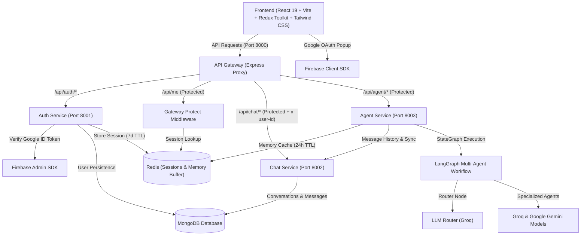
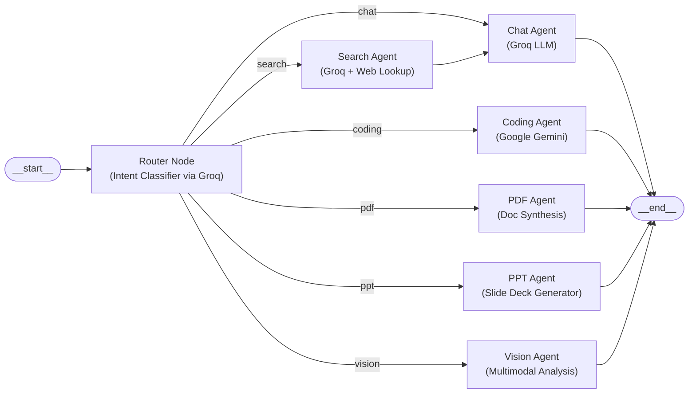

# 🧠 Omnix AI

<div align="center">

[](#)
[](#)
[](#)
[](#)
[](#)
[](#)

<p align="center">
  <b>An intelligent, enterprise-grade, microservices-driven AI platform built with LangGraph multi-agent orchestration, distributed Redis session & memory management, and modern React 19 interface.</b>
</p>
  
</div>

---

> [!NOTE]
> **Project Status:** 🚧 **Under Active Development**  
> Core microservices architecture, authentication, chat management, agent routing, Redis memory, and the main frontend chat interface are fully functional. Specialized agent execution nodes (PDF, PPT, Code Sandbox, Vision) and live response streaming are currently in progress.

---

## 📌 Project Overview

**Omnix AI** is an advanced AI assistant and multi-agent execution platform built on top of a scalable, decoupled microservices architecture:
- **Centralized API Gateway:** A single entry point that manages CORS, cookie authentication, Redis session validation, and transparent reverse proxy routing with downstream identity injection (`x-user-id`).
- **Distributed Session Authentication:** Firebase Admin verification paired with secure Redis sessions (7-day TTL) and HTTP-only cookies.
- **Dedicated Chat Service:** MongoDB-backed conversation and message persistence, managing chat histories, title renaming, and thread metadata.
- **Multi-Agent Orchestration with LangGraph:** Dynamic prompt routing using `@langchain/langgraph` to classify intent and dispatch queries to specialized agent nodes (Chat, Coding, Search, PDF, PPT, Vision) powered by Groq and Google Gemini models.
- **Short-Term Conversational Memory:** Redis-backed sliding memory buffer (24-hour TTL) for low-latency agent context hydration with fallback to MongoDB.

---

## 🏗️ System Architecture



---

## 🤖 LangGraph Multi-Agent Workflow

The **Agent Microservice** uses `@langchain/langgraph` to dynamically evaluate user intent and execute specialized workflows:



### Agent Node Breakdown & LLM Providers

| Agent Node | Responsibility | Engine / Model Provider |
| :--- | :--- | :--- |
| **Router** | Intent analysis and dynamic agent dispatch | Groq (`openai/gpt-oss-120b`) |
| **Chat** | General discussion, Q&A, reasoning, and explanations | Groq (`openai/gpt-oss-120b`) |
| **Search** | Real-time web knowledge, current events, and live lookup | Groq (`openai/gpt-oss-120b`) -> Chat Pipeline |
| **Coding** | Code generation, debugging, refactoring, architecture | Google Gemini (`gemini-2.5-flash`) |
| **PDF** | Document context analysis, Q&A, and PDF generation | LangChain Document Pipeline |
| **PPT** | Presentation deck outline and slide deck generation | Custom Presentation Engine |
| **Vision** | Visual synthesis and multimodal image handling | Google Gemini / Multimodal Vision |

---

## 🚀 Tech Stack

### **Frontend**
- **Framework:** [React 19](https://react.dev/) + [Vite](https://vitejs.dev/)
- **State Management:** [Redux Toolkit](https://redux-toolkit.js.org/) + [React Redux](https://react-redux.js.org/)
- **Styling:** [Tailwind CSS v4](https://tailwindcss.com/)
- **Icons:** [Lucide React](https://lucide.dev/) & [React Icons](https://react-icons.github.io/react-icons/)
- **Markdown & Code:** `react-markdown` with structured formatting
- **Auth Client:** [Firebase Authentication](https://firebase.google.com/) (Google OAuth popup flow)
- **HTTP Client:** [Axios](https://axios-http.com/) (with `withCredentials: true`)

### **Backend & Microservices**
- **Runtime:** [Node.js](https://nodejs.org/) (ES Modules)
- **Framework:** [Express.js](https://expressjs.com/)
- **API Gateway:** Reverse proxy routing via `express-http-proxy` with custom header decorator (`proxyWithHeader`)
- **Agent Orchestration:** [LangGraph](https://langchain-ai.github.io/langgraphjs/) (`@langchain/langgraph`), `@langchain/core`
- **LLM Integrations:** `@langchain/groq` (Groq), `@langchain/google-genai` (Google Gemini)
- **Database & ODM:** [MongoDB](https://www.mongodb.com/) via [Mongoose](https://mongoosejs.com/)
- **Session & Memory Store:** [Redis](https://redis.io/) via `ioredis`
- **Authentication & Security:** Firebase Admin SDK, HTTP-only secure cookies, CORS, `cookie-parser`
- **Logging & Utilities:** `morgan`, `dotenv`

---

## 📂 Project Structure

```text
Omnix_AI/
├── backend/
│   ├── docker-compose.yml              # Docker Compose for Redis (Port 6379)
│   ├── package.json
│   ├── gateway/                        # API Gateway (Port 8000)
│   │   ├── controllers/
│   │   │   └── user.controller.js      # Session profile controller (/api/me)
│   │   ├── middleware/
│   │   │   └── auth.middleware.js      # Redis session validation (protect)
│   │   ├── utils/
│   │   │   └── proxyWithHeader.js      # Injects authenticated x-user-id downstream
│   │   ├── index.js                    # Gateway entry point & proxy routes
│   │   └── package.json
│   ├── services/
│   │   ├── auth/                       # Auth Microservice (Port 8001)
│   │   │   ├── config/                 # MongoDB connection & Firebase Admin setup
│   │   │   ├── controllers/            # Google login/logout & session persistence
│   │   │   ├── models/                 # User Mongoose Schema
│   │   │   ├── routes/                 # Auth routes (/api/auth/login, /logout)
│   │   │   ├── serviceAccountKey.json  # Firebase Admin credentials
│   │   │   └── index.js
│   │   ├── chat/                       # Chat & History Microservice (Port 8002)
│   │   │   ├── config/                 # MongoDB connection
│   │   │   ├── controllers/            # Conversation CRUD & message storage
│   │   │   ├── models/                 # Conversation & Message Mongoose Schemas
│   │   │   ├── routes/                 # Chat routes (/create, /update, /messages)
│   │   │   └── index.js
│   │   └── agent/                      # Multi-Agent Microservice (Port 8003)
│   │       ├── agents/                 # Agent node handlers (chat, coding, etc.)
│   │       ├── config/                 # LLM provider configs & Redis memory
│   │       ├── controllers/            # Agent controller (invokes LangGraph)
│   │       ├── graph/                  # LangGraph workflow, router, and state
│   │       │   ├── graph.js            # StateGraph compile & workflow edges
│   │       │   ├── router.js           # Dynamic intent routing logic
│   │       │   └── state.js            # LangGraph State definition
│   │       ├── utils/                  # Message history fetch utilities
│   │       └── index.js
│   └── shared/
│       └── redis/
│           └── redis.js                # Shared ioredis client instance
├── frontend/                           # React 19 + Vite Frontend
│   ├── src/
│   │   ├── components/
│   │   │   ├── Artifact.jsx            # Artifacts & code preview panel
│   │   │   ├── ChatArea.jsx            # Main chat viewport container
│   │   │   ├── ChatInput.jsx           # Input box with agent pills & actions
│   │   │   ├── MessageBubble.jsx       # Markdown-formatted message bubble
│   │   │   ├── MessageList.jsx         # Message list & empty state suggestions
│   │   │   ├── Nav.jsx                 # Top header with active chat details
│   │   │   └── SideBar.jsx             # Collapsible sidebar with chat histories
│   │   ├── features/                   # API interaction helper modules
│   │   ├── pages/
│   │   │   └── Home.jsx                # Home dashboard & login modal
│   │   ├── redux/
│   │   │   ├── conversationSlice.js    # Conversations & selection state
│   │   │   ├── messageSlice.js         # Messages array state
│   │   │   ├── userSlice.js            # User profile state
│   │   │   └── store.js                # Redux store configuration
│   │   ├── utils/                      # Axios & Firebase client configs
│   │   └── App.jsx
│   └── package.json
└── README.md
```

---

## ⚡ Implementation Progress & Status

### ✅ What Has Been Implemented

#### 1. Architecture & Security Infrastructure
- [x] **Centralized API Gateway (Port 8000):** Reverse proxy routing for all internal microservices with CORS, cookie parsing, and morgan logging.
- [x] **Secure Downstream Header Injection:** Automatically resolves the authenticated user from Redis and injects `x-user-id` into downstream requests.
- [x] **Google OAuth Login via Firebase:** Frontend popup authentication generating Firebase ID tokens.
- [x] **Backend ID Token Verification:** Auth service validates Firebase tokens using Firebase Admin SDK.
- [x] **Distributed Session Management:** Secure UUID-based session keys stored in Redis with 7-day TTL (`session:<sessionID>`) and HTTP-only cookies.
- [x] **Gateway Authentication Middleware (`protect`):** Direct Redis session validation at the Gateway layer to protect downstream routes.
- [x] **Session Hydration on Startup:** Redux Toolkit auto-fetches `/api/me` on initial load to maintain persistent login across page refreshes.
- [x] **Logout Flow:** Deletes session from Redis and clears browser cookies.

#### 2. Chat Service & Thread Lifecycle
- [x] **Conversation Management:** Create new conversations, fetch user conversation lists sorted newest-first, and view historical threads.
- [x] **Auto-Generated Conversation Titles:** Chat input automatically renames `"New Chat"` to the first 30–40 characters of the user's initial prompt.
- [x] **Message Storage:** MongoDB persistence for both user queries and AI assistant responses.

#### 3. LangGraph Multi-Agent Orchestration
- [x] **Compiled `StateGraph` Engine:** Configured `@langchain/langgraph` agent workflow with modular nodes and conditional routing edges.
- [x] **Intent Classification Router:** Uses Groq (`openai/gpt-oss-120b`) to dynamically route prompts to specialized agent nodes (`chat`, `coding`, `search`, `pdf`, `ppt`, `vision`).
- [x] **Multi-LLM Integration:** Dynamic model switcher supporting Groq and Google Gemini (`gemini-2.5-flash`).
- [x] **Short-Term Redis Memory Buffer:** Caches conversation context in Redis (`messages-<conversationId>`) with a 24-hour TTL, auto-hydrating from MongoDB on cache misses and trimming to a 20-message window.
- [x] **Bidirectional Chat Sync:** Agent microservice auto-saves prompt and response messages into Chat Service.

#### 4. Frontend User Experience (React 19 + Tailwind CSS)
- [x] **Modern Dark Glassmorphic Interface:** Tailored dark color palette (`#0d0f14`), custom scrollbars, and micro-animations.
- [x] **Collapsible Sidebar:** Toggleable sidebar with expanded and collapsed (icon-only) modes.
- [x] **Agent Selector Pills:** Interactive agent filter buttons (**Auto, Chat, Coding, PDF, PPT, Vision, Search**) with gradient highlight states.
- [x] **Markdown Message Rendering:** `react-markdown` message bubbles supporting headings, code blocks, lists, and bold text.
- [x] **Empty State Quick Starters:** Suggested prompts on initial screen (*"Build a Netflix clone"*, *"Explain Redis"*, *"Build a dashboard"*).
- [x] **Artifacts Side Panel:** Base layout for code previews and generated files.

---

### 🚀 What Will Be Implemented Next (Upcoming Roadmap)

#### 1. Specialized Agent Implementations & Tool Execution
- [ ] **Coding Agent Sandbox & Runner:** Interactive code execution sandbox with error feedback and live previews in the Artifacts panel.
- [ ] **Live Web Search Agent:** Integration with Tavily / DuckDuckGo Search API for real-time web lookups, source citations, and URL summaries.
- [ ] **PDF & Document RAG Agent:** Vector embeddings (using Pinecone / ChromaDB), PDF text extraction, document Q&A, and PDF generation.
- [ ] **Presentation (PPT) Generator Agent:** Automated generation and download of structured slide decks (`.pptx`).
- [ ] **Multimodal Vision Agent:** Direct image uploads, visual OCR analysis, diagram understanding, and image generation.

#### 2. Streaming & Real-Time Communication
- [ ] **Server-Sent Events (SSE) / WebSockets:** Token-by-token real-time streaming from LangGraph to the frontend chat bubble for a typewriter effect.
- [ ] **Live Agent Status Indicators:** Real-time visual feedback showing current agent execution step (*"Searching the web..."*, *"Synthesizing code..."*).

#### 3. Advanced Frontend Features & Multimodal Input
- [ ] **Voice-to-Text & Audio Synthesis:** Microphone input using Web Speech API / Whisper transcription and text-to-speech audio playback.
- [ ] **File & Image Attachments:** File uploader for drag-and-drop code files, documents, and images (via Cloudinary / AWS S3).
- [ ] **Interactive Artifacts Viewer:** Tabbed code editor, syntax-highlighted code copies, and live HTML/React component previews.

#### 4. Rate Limiting, Quotas & Production DevOps
- [ ] **Redis Rate Limiting:** Token-bucket rate limiting per user tier to prevent API abuse.
- [ ] **Token Usage & Quotas Tracking:** Monitor and display daily/monthly token consumption.
- [ ] **Full Multi-Service Dockerization:** Complete root `docker-compose.yml` orchestrating Gateway, Auth, Chat, Agent, Redis, and Frontend in unified container network.

---

## 🛠️ Getting Started

### Prerequisites
- [Node.js (v18+)](https://nodejs.org/)
- [Docker & Docker Desktop](https://www.docker.com/) (for Redis)
- [MongoDB Atlas](https://www.mongodb.com/) or local MongoDB instance
- [Firebase Project](https://console.firebase.google.com/) with Google Sign-In & Service Account Key
- [Groq API Key](https://console.groq.com/) & [Google AI Gemini API Key](https://aistudio.google.com/)

---

### 1. Start Redis Container

From the `backend` directory, spin up the Redis container:
```bash
cd backend
docker compose up -d
```

---

### 2. Environment Configuration

Create `.env` files in each service directory:

#### 🔹 API Gateway (`backend/gateway/.env`)
```env
PORT=8000
FRONTEND_URL=http://localhost:5173
AUTH_SERVICE=http://localhost:8001
CHAT_SERVICE=http://localhost:8002
AGENT_SERVICE=http://localhost:8003
REDIS_URL=redis://localhost:6379
```

#### 🔹 Auth Service (`backend/services/auth/.env`)
```env
PORT=8001
MONGO_URI=your_mongodb_connection_string
REDIS_URL=redis://localhost:6379
```
> Place your Firebase service account JSON credentials at `backend/services/auth/serviceAccountKey.json`.

#### 🔹 Chat Service (`backend/services/chat/.env`)
```env
PORT=8002
MONGO_URI=your_mongodb_connection_string
```

#### 🔹 Agent Service (`backend/services/agent/.env`)
```env
PORT=8003
MONGO_URI=your_mongodb_connection_string
GROQ_API_KEY=your_groq_api_key
GOOGLE_API_KEY=your_google_gemini_api_key
CHAT_SERVICE=http://localhost:8002
REDIS_URL=redis://localhost:6379
```

#### 🔹 Frontend (`frontend/.env`)
```env
VITE_SERVER_URL=http://localhost:8000
VITE_FIREBASE_API_KEY=your_firebase_api_key
VITE_FIREBASE_AUTH_DOMAIN=your_project.firebaseapp.com
VITE_FIREBASE_PROJECT_ID=your_project_id
VITE_FIREBASE_STORAGE_BUCKET=your_project.appspot.com
VITE_FIREBASE_MESSAGING_SENDER_ID=your_sender_id
VITE_FIREBASE_APP_ID=your_app_id
```

---

### 3. Running Services Locally

Start the microservices in separate terminals:

```bash
# Terminal 1: Redis (Docker)
cd backend
docker compose up -d

# Terminal 2: API Gateway (Port 8000)
cd backend/gateway
npm install
npm run dev

# Terminal 3: Auth Service (Port 8001)
cd backend/services/auth
npm install
npm run dev

# Terminal 4: Chat Service (Port 8002)
cd backend/services/chat
npm install
npm run dev

# Terminal 5: Agent Service (Port 8003)
cd backend/services/agent
npm install
npm run dev

# Terminal 6: Frontend Client (Port 5173)
cd frontend
npm install
npm run dev
```

---

## 📡 API Endpoints Reference

### **1. Gateway & Authentication (`/api/auth`)**
| Method | Endpoint | Description | Protected |
| :--- | :--- | :--- | :---: |
| `GET` | `/` | Gateway health check | ❌ |
| `GET` | `/api/me` | Validates Redis session and returns current user profile | ✅ (Cookie) |
| `POST` | `/api/auth/login` | Verifies Firebase ID token, creates/finds user in MongoDB, sets 7-day Redis session cookie | ❌ |
| `GET` | `/api/auth/logout` | Invalidation of Redis session key and cookie removal | ✅ (Cookie) |

### **2. Chat Management (`/api/chat`)**
*(Routed via Gateway with automatic `x-user-id` header injection)*

| Method | Endpoint | Description | Protected |
| :--- | :--- | :--- | :---: |
| `GET` | `/api/chat/create-conversation` | Creates a new conversation thread for the authenticated user | ✅ |
| `GET` | `/api/chat/get-conversations` | Fetches all conversations belonging to the user (sorted newest first) | ✅ |
| `POST` | `/api/chat/update-conversation` | Updates conversation title (`{ id, title }`) | ✅ |
| `POST` | `/api/chat/save-message` | Saves a message (`{ conversationId, role, content }`) | ✅ |
| `GET` | `/api/chat/get-messages/:conversationId` | Fetches all message history for a specific conversation thread | ✅ |

### **3. Multi-Agent Orchestration (`/api/agent`)**
*(Routed via Gateway)*

| Method | Endpoint | Description | Protected |
| :--- | :--- | :--- | :---: |
| `POST` | `/api/agent/chat` | Syncs message to Chat Service, runs LangGraph router & agent node, returns AI response | ✅ |

---

## 📄 License

This project is licensed for development and educational use.
