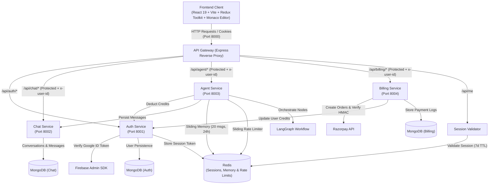
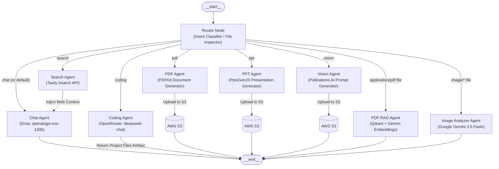

# 🧠 Omnix AI

An enterprise-grade, distributed multi-agent AI assistant and interactive developer workspace. Omnix AI orchestrates specialized autonomous agents through **LangGraph**, providing contextual chat with memory, multi-file code generation with live Monaco Editor sandboxing, document synthesis (PDF & PPT), multimodal image analysis, vector-based PDF RAG, web search, and credit-based subscription billing.

---

## 📑 Table of Contents

- [System Architecture](#-system-architecture)
- [Multi-Agent Orchestration (LangGraph)](#-multi-agent-orchestration-langgraph)
- [Microservices Overview](#-microservices-overview)
  - [1. API Gateway (Port 8000)](#1-api-gateway-port-8000)
  - [2. Auth Service (Port 8001)](#2-auth-service-port-8001)
  - [3. Chat Service (Port 8002)](#3-chat-service-port-8002)
  - [4. Agent Service (Port 8003)](#4-agent-service-port-8003)
  - [5. Billing Service (Port 8004)](#5-billing-service-port-8004)
- [Specialized Agent Capabilities](#-specialized-agent-capabilities)
  - [Multi-File Code Sandbox & Monaco Editor](#multi-file-code-sandbox--monaco-editor)
  - [Document RAG Pipeline (Qdrant + Gemini Embeddings)](#document-rag-pipeline-qdrant--gemini-embeddings)
  - [Multimodal Vision & Image Analysis](#multimodal-vision--image-analysis)
  - [Document & Slide Deck Synthesis (PDF & PPT)](#document--slide-deck-synthesis-pdf--ppt)
  - [Live Web Intelligence (Tavily)](#live-web-intelligence-tavily)
- [Session Management, Security & Rate Limiting](#-session-management-security--rate-limiting)
- [Billing, Plans & Credit Economics](#-billing-plans--credit-economics)
- [Tech Stack](#-tech-stack)
- [Repository Structure](#-repository-structure)
- [Getting Started & Local Setup](#-getting-started--local-setup)
  - [Prerequisites](#prerequisites)
  - [1. Infrastructure Setup (Redis)](#1-infrastructure-setup-redis)
  - [2. Environment Variables](#2-environment-variables)
  - [3. Running the Backend Microservices](#3-running-the-backend-microservices)
  - [4. Running the Frontend](#4-running-the-frontend)
- [API Reference](#-api-reference)

---

## 🏗️ System Architecture

Omnix AI is built on a distributed microservices architecture behind an Express reverse-proxy gateway. Downstream services remain decoupled and communicate securely using internal HTTP endpoints and authenticated identity headers (`x-user-id`).



---

## 🤖 Multi-Agent Orchestration (LangGraph)

The **Agent Service** coordinates specialized tasks using a compiled `@langchain/langgraph` `StateGraph`. Incoming user requests pass through an intelligent router that routes to specific agent nodes based on explicit agent selection, uploaded file MIME types, or LLM intent classification.



### LangGraph Agent Summary

| Agent | Routing Condition | Underlying Model / Tool | Output Format | Cost | Rate Limit |
| :--- | :--- | :--- | :--- | :---: | :---: |
| **Router** | Initial graph entry node | Groq (`openai/gpt-oss-120b`) / File MIME check | Target node identifier | 0 | — |
| **Chat** | General discussion, Q&A | Groq (`openai/gpt-oss-120b`) + Redis Memory | Markdown with code formatting | 1 Credit | 20 req/min |
| **Search** | Current events, web queries | Tavily Search API (`@langchain/tavily`) | Web snippets & images piped into Chat | 5 Credits | 5 req/min |
| **Coding** | Software engineering requests | OpenRouter (`deepseek/deepseek-chat`) | Multi-file JSON bundle or Markdown | 10 Credits | 5 req/min |
| **PDF** | Document synthesis | Groq + `pdfkit` + AWS S3 | PDF binary + 24h presigned download URL | 10 Credits | 5 req/min |
| **PPT** | Presentation deck generation | Groq + `pptxgenjs` + AWS S3 | 6-slide PPTX + 24h presigned download URL | 10 Credits | 5 req/min |
| **Vision** | Text-to-image synthesis | Groq Prompt Engine + Pollinations AI + S3 | PNG binary + 24h presigned download URL | 10 Credits | 3 req/min |
| **PDF RAG** | Uploaded `.pdf` documents | `pdf-parse` + `gemini-embedding-001` + Qdrant | Grounded citation response | 10 Credits | 5 req/min |
| **Image Analyzer** | Uploaded `image/*` files | Google Gemini (`gemini-3.5-flash`) Multimodal | Visual explanation & OCR text | 10 Credits | 3 req/min |

---

## 🧩 Microservices Overview

### 1. API Gateway (Port 8000)
- **Role:** Central entry point for all frontend traffic.
- **Key Responsibilities:**
  - CORS configuration with credential support.
  - Redis session cookie verification middleware (`protect`).
  - Downstream reverse proxy forwarding using `express-http-proxy`.
  - Injects authenticated user ID as `x-user-id` header to downstream services.
  - Exposes `GET /api/me` for current session hydration.

### 2. Auth Service (Port 8001)
- **Role:** Identity, user lifecycle, and credit balance management.
- **Key Responsibilities:**
  - Validates Google OAuth ID tokens via Firebase Admin SDK.
  - Creates or fetches users in MongoDB (`User` model).
  - Generates secure UUID session IDs stored in Redis with 7-day expiration.
  - Sets HTTP-only `session` cookie.
  - Manages credit balance deduction and subscription tier updates.

### 3. Chat Service (Port 8002)
- **Role:** Conversation history and message persistence.
- **Key Responsibilities:**
  - Creates, reads, and updates conversation threads.
  - Stores user and assistant messages with attachments, images, and artifact schemas.
  - Retrieves chat histories for seamless thread resumption.

### 4. Agent Service (Port 8003)
- **Role:** LangGraph multi-agent execution pipeline.
- **Key Responsibilities:**
  - Manages file uploads via `multer` for RAG and image analysis.
  - Maintains sliding conversation memory in Redis (last 20 messages, 24h TTL).
  - Enforces per-user, per-agent sliding-window rate limits in Redis.
  - Executes document generation (PDFKit), slide deck compilation (PptxGenJS), vector search (Qdrant), and S3 asset uploads.

### 5. Billing Service (Port 8004)
- **Role:** Payment processing and plan management.
- **Key Responsibilities:**
  - Creates Razorpay payment orders.
  - Performs cryptographic SHA-256 HMAC signature verification on payment callbacks.
  - Updates payment status logs in MongoDB and notifies Auth Service to credit user accounts.

---

## ⚡ Specialized Agent Capabilities

### Multi-File Code Sandbox & Monaco Editor
When the **Coding Agent** receives a request, it runs a two-step process:
1. **Intent Classification:** Classifies prompt into `CODE_GENERATION`, `CODE_REVIEW`, `CODE_EXPLANATION`, `DEBUGGING`, `OPTIMIZATION`, `CONVERSATION`, or `DOCUMENTATION`.
2. **Project Synthesis:** For `CODE_GENERATION`, it generates structured JSON containing `index.html`, `style.css`, and `script.js` along with valid Unsplash visual assets.
3. **Interactive Workspace:** The frontend displays code in Microsoft Monaco Editor (`vs-dark` theme) with multi-file tabs and a sandboxed `<iframe>` preview.

### Document RAG Pipeline (Qdrant + Gemini Embeddings)
- When a `.pdf` file is uploaded, text is extracted using `pdf-parse`.
- Content is partitioned using `RecursiveCharacterTextSplitter` (chunk size: 1000 characters, overlap: 200 characters).
- Vectors are generated via `GoogleGenerativeAIEmbeddings` (`gemini-embedding-001`) and indexed dynamically into a temporary Qdrant collection.
- Top 5 relevant chunks are retrieved via similarity search and injected into the prompt for grounded Q&A.

### Multimodal Vision & Image Analysis
- Uploaded images (`image/png`, `image/jpeg`, `image/webp`) are converted to Base64 buffers.
- Sent directly to Google Gemini (`gemini-3.5-flash`) for visual reasoning, OCR text extraction, and diagram analysis.

### Document & Slide Deck Synthesis (PDF & PPT)
- **PDF Generation:** Structured JSON from LLM is compiled into styled multi-page PDF documents via `pdfkit`, uploaded to AWS S3, and returned with a 24-hour presigned URL.
- **PPT Generation:** Structured JSON containing 6 topical slides is compiled into a 16:9 `.pptx` presentation deck via `pptxgenjs`, uploaded to AWS S3, and returned with a 24-hour presigned URL.

### Live Web Intelligence (Tavily)
- Web search queries trigger the Tavily Search API.
- Live search snippets and images are piped directly into the Chat Agent's context window to produce up-to-date conversational answers.

---

## 🛡️ Session Management, Security & Rate Limiting

- **HTTP-Only Cookie Sessions:** Sessions are stored in Redis (`session:<sessionId>`) with a 7-day TTL and transmitted via HTTP-only cookies to prevent client-side script access.
- **Stateless Downstream Microservices:** The API Gateway validates Redis session tokens and decorates downstream service requests with `x-user-id`.
- **Per-Agent Sliding Rate Limiting:** Enforces independent per-user rate limit keys in Redis (`rate:<userId>:<agent>`) with 60-second sliding windows, returning precise retry timestamps (`retryAfter`) when limits are exceeded.
- **Payment Signature Verification:** Razorpay webhook callbacks and payment verification use cryptographic HMAC SHA-256 signatures to prevent fraudulent transactions.

---

## 💳 Billing, Plans & Credit Economics

Omnix AI features an integrated credit economy backed by Razorpay:

### Available Plans

| Plan | Price | Monthly Credits | Validity |
| :--- | :---: | :---: | :---: |
| **Free** | ₹0 | 100 Credits | 30 Days |
| **Starter** | ₹199 | 500 Credits | 30 Days |
| **Pro** | ₹499 | 1,000 Credits | 30 Days |

### Credit Deduction Rules

- 💬 **Chat Query:** `1 Credit`
- 🌐 **Web Search Query:** `5 Credits`
- 💻 **Coding Studio Project:** `10 Credits`
- 📄 **PDF Synthesis / PDF RAG:** `10 Credits`
- 📊 **PowerPoint Deck Generation:** `10 Credits`
- 🎨 **Vision Image Generation / Image Analyzer:** `10 Credits`

---

## 🚀 Tech Stack

### **Frontend**
- **Framework:** React 19 + Vite 8
- **State Management:** Redux Toolkit + React Redux
- **Code Editor:** `@monaco-editor/react` (Monaco Editor)
- **Styling:** Tailwind CSS v4
- **Animations:** Motion (Framer Motion)
- **Icons:** Lucide React, React Icons
- **Markdown & Code Highlighting:** `react-markdown`, `remark-gfm`, `react-syntax-highlighter` (Prism)
- **Authentication:** Firebase Client SDK (Google OAuth)
- **HTTP Client:** Axios (with cross-origin credentials)

### **Backend Microservices**
- **Runtime:** Node.js (ES Modules)
- **Web Framework:** Express.js (Express v5)
- **API Gateway:** `express-http-proxy`
- **Agent Orchestration:** LangGraph (`@langchain/langgraph`), `@langchain/core`
- **LLM Integrations:** `@langchain/groq`, `@langchain/google-genai`, `@langchain/openrouter`
- **Vector Database & Embeddings:** Qdrant (`@langchain/qdrant`), Google GenAI Embeddings (`gemini-embedding-001`)
- **Document & Slide Generation:** `pdfkit`, `pptxgenjs`, `pdf-parse`
- **Search Tooling:** `@langchain/tavily` (Tavily API)
- **Cloud Storage:** AWS SDK for JavaScript v3 (`@aws-sdk/client-s3`, `@aws-sdk/s3-request-presigner`)
- **Payment Processing:** Razorpay Node SDK (`razorpay`), Node Crypto (HMAC SHA-256)
- **Databases & Cache:** MongoDB Atlas via Mongoose, Redis via `ioredis`
- **File Ingestion:** Multer (multipart/form-data upload handling)

---

## 📂 Repository Structure

```text
Omnix_AI/
├── backend/
│   ├── docker-compose.yml              # Redis service definition (Port 6379)
│   ├── package.json
│   ├── shared/
│   │   └── redis/
│   │       └── redis.js                # Shared ioredis client singleton
│   ├── gateway/                        # API Gateway (Port 8000)
│   │   ├── controllers/
│   │   │   └── user.controller.js      # Session profile handler (/api/me)
│   │   ├── middleware/
│   │   │   └── auth.middleware.js      # Redis session validation (protect)
│   │   ├── utils/
│   │   │   └── proxyWithHeader.js      # Downstream x-user-id header decorator
│   │   ├── index.js                    # Gateway entry & routing rules
│   │   └── package.json
│   └── services/
│       ├── auth/                       # Auth Microservice (Port 8001)
│       │   ├── config/                 # MongoDB & Firebase Admin initialization
│       │   ├── controllers/            # Login, logout, credit deduction handlers
│       │   ├── models/                 # User Mongoose model
│       │   ├── routes/                 # Auth routes (/login, /logout, /deduct-credits)
│       │   ├── serviceAccountKey.json  # Firebase Admin credentials
│       │   └── index.js
│       ├── chat/                       # Chat Microservice (Port 8002)
│       │   ├── config/                 # MongoDB connection
│       │   ├── controllers/            # Conversation & Message CRUD handlers
│       │   ├── models/                 # Conversation & Message Mongoose schemas
│       │   ├── routes/                 # Chat routes (/create, /messages, etc.)
│       │   └── index.js
│       ├── agent/                      # Multi-Agent Microservice (Port 8003)
│       │   ├── agents/                 # Specialized agent implementations
│       │   │   ├── chat.agent.js       # Conversational agent with Redis memory
│       │   │   ├── coding.agent.js     # DeepSeek multi-file project generator
│       │   │   ├── imageAnalyzer.agent.js # Gemini 3.5 Flash vision agent
│       │   │   ├── pdf.agent.js        # PDFKit document generator + S3 upload
│       │   │   ├── pdfRag.agent.js     # Qdrant + Gemini embeddings PDF RAG
│       │   │   ├── ppt.agent.js        # PptxGenJS 16:9 slide deck generator
│       │   │   ├── search.agent.js     # Tavily web search agent
│       │   │   └── vision.agent.js     # Text-to-image prompt builder + S3 upload
│       │   ├── config/                 # Configuration & client factories
│       │   │   ├── agentLimit.js       # Sliding rate limiter in Redis
│       │   │   ├── db.js               # MongoDB connection
│       │   │   ├── embeddings.js       # Google GenAI embeddings client
│       │   │   ├── llmModels.js        # Groq, Gemini, OpenRouter model factory
│       │   │   ├── memory.js           # Redis sliding memory buffer (24h TTL)
│       │   │   ├── multer.js           # Multer file upload configuration
│       │   │   ├── s3.js               # AWS S3 client
│       │   │   ├── tavily.js           # Tavily search tool instance
│       │   │   └── vectorDb.js         # Qdrant vector store factory
│       │   ├── controllers/            # Agent controller invoking LangGraph
│       │   ├── graph/                  # LangGraph State Machine definitions
│       │   │   ├── graph.js            # StateGraph definition & conditional edges
│       │   │   ├── router.js           # Intent & file classifier node
│       │   │   └── state.js            # LangGraph Annotation state schema
│       │   ├── routes/                 # Agent route (/chat)
│       │   ├── utils/                  # Document generation & storage helpers
│       │   └── index.js
│       └── billing/                    # Billing Microservice (Port 8004)
│           ├── config/                 # Razorpay client & Plans definition
│           ├── controllers/            # Order creation & HMAC verification
│           ├── models/                 # Payment Mongoose model
│           ├── routes/                 # Billing routes (/create, /verify)
│           └── index.js
├── frontend/                           # React 19 + Vite Frontend Application
│   ├── src/
│   │   ├── components/
│   │   │   ├── Artifact.jsx            # Monaco Editor & live iframe sandbox
│   │   │   ├── BillingDrawer.jsx       # Subscription plans & Razorpay modal
│   │   │   ├── ChatArea.jsx            # Chat view & scroll area
│   │   │   ├── ChatInput.jsx           # Input bar, agent selectors & upload button
│   │   │   ├── LoadingAnimation.jsx    # Pulsing status loader for agents
│   │   │   ├── MessageBubble.jsx       # Markdown message bubble & syntax highlighter
│   │   │   ├── MessageList.jsx         # Message feed & prompt chips
│   │   │   ├── Nav.jsx                 # Top header & active conversation title
│   │   │   └── SideBar.jsx             # Thread sidebar, credit meter & user card
│   │   ├── features/                   # Axios API service helpers
│   │   ├── pages/
│   │   │   └── Home.jsx                # Main workspace shell & auth guard
│   │   ├── redux/                      # Redux Toolkit store & slices
│   │   │   ├── conversationSlice.js    # Active conversation & thread state
│   │   │   ├── messageSlice.js         # Messages array & artifact state
│   │   │   ├── userSlice.js            # User profile, credits & plan state
│   │   │   └── store.js                # Redux store configuration
│   │   ├── utils/                      # Axios instance & Firebase client config
│   │   ├── App.jsx
│   │   └── main.jsx
│   └── package.json
└── README.md
```

---

## 🛠️ Getting Started & Local Setup

### Prerequisites

- **Node.js (v18+)** & **npm**
- **Docker** (for running Redis)
- **MongoDB Atlas** database or local MongoDB instance
- **Qdrant Cloud** cluster or local Qdrant instance
- **Firebase Project** with Google Authentication enabled
- **AWS S3 Bucket** with PutObject and GetObject access
- **Razorpay Account** (Test Key ID & Key Secret)
- **API Keys:**
  - Groq API Key (`GROQ_API_KEY`)
  - Google Gemini API Key (`GOOGLE_API_KEY`)
  - OpenRouter API Key (`OPENROUTER_API_KEY`)
  - Tavily Search API Key (`TAVILY_API_KEY`)

---

### 1. Infrastructure Setup (Redis)

Start the Redis container using Docker Compose:

```bash
cd backend
docker compose up -d
```

Verify Redis is running on port `6379`:
```bash
docker ps
```

---

### 2. Environment Variables

Create `.env` files in each service directory according to the following configurations:

#### 🔹 Gateway (`backend/gateway/.env`)
```env
PORT=8000
FRONTEND_URL=http://localhost:5173
AUTH_SERVICE=http://localhost:8001
CHAT_SERVICE=http://localhost:8002
AGENT_SERVICE=http://localhost:8003
BILLING_SERVICE=http://localhost:8004
REDIS_URL=redis://localhost:6379
```

#### 🔹 Auth Service (`backend/services/auth/.env`)
```env
PORT=8001
MONGO_URI=mongodb+srv://<username>:<password>@cluster.mongodb.net/omnix_auth?retryWrites=true&w=majority
REDIS_URL=redis://localhost:6379
```
> Place your Firebase Admin Service Account Key JSON at:  
> `backend/services/auth/serviceAccountKey.json`

#### 🔹 Chat Service (`backend/services/chat/.env`)
```env
PORT=8002
MONGO_URI=mongodb+srv://<username>:<password>@cluster.mongodb.net/omnix_chat?retryWrites=true&w=majority
```

#### 🔹 Agent Service (`backend/services/agent/.env`)
```env
PORT=8003
MONGO_URI=mongodb+srv://<username>:<password>@cluster.mongodb.net/omnix_agent?retryWrites=true&w=majority
CHAT_SERVICE=http://localhost:8002
AUTH_SERVICE=http://localhost:8001
REDIS_URL=redis://localhost:6379

# AI & Search API Keys
GROQ_API_KEY=your_groq_api_key
GOOGLE_API_KEY=your_google_api_key
OPENROUTER_API_KEY=your_openrouter_api_key
TAVILY_API_KEY=your_tavily_api_key

# Vector Database (Qdrant)
QDRANT_URL=https://your-cluster.qdrant.tech:6333
QDRANT_API_KEY=your_qdrant_api_key

# AWS S3 Storage
AWS_REGION=us-east-1
AWS_ACCESS_KEY_ID=your_aws_access_key
AWS_SECRET_KEY=your_aws_secret_key
AWS_BUCKET_NAME=your_s3_bucket_name
```

#### 🔹 Billing Service (`backend/services/billing/.env`)
```env
PORT=8004
MONGO_URI=mongodb+srv://<username>:<password>@cluster.mongodb.net/omnix_billing?retryWrites=true&w=majority
AUTH_SERVICE=http://localhost:8001
RAZORPAY_KEY_ID=rzp_test_your_key_id
RAZORPAY_KEY_SECRET=your_razorpay_secret
```

#### 🔹 Frontend Client (`frontend/.env`)
```env
VITE_SERVER_URL=http://localhost:8000
VITE_RAZORPAY_KEY_ID=rzp_test_your_key_id
VITE_RAZORPAY_KEY_SECRET=your_razorpay_secret

# Firebase Client Configuration
VITE_FIREBASE_KEY=your_firebase_api_key
VITE_FIREBASE_AUTH_DOMAIN=your_project.firebaseapp.com
VITE_FIREBASE_PROJECT_ID=your_project_id
VITE_FIREBASE_STORAGE_BUCKET=your_project.appspot.com
VITE_FIREBASE_MESSAGING_SENDER_ID=your_sender_id
VITE_FIREBASE_APP_ID=your_app_id
VITE_FIREBASE_MEASUREMENT_ID=your_measurement_id
```

---

### 3. Running the Backend Microservices

Open separate terminal tabs for each service:

```bash
# Terminal 1: Gateway (Port 8000)
cd backend/gateway
npm install
npm run dev

# Terminal 2: Auth Service (Port 8001)
cd backend/services/auth
npm install
npm run dev

# Terminal 3: Chat Service (Port 8002)
cd backend/services/chat
npm install
npm run dev

# Terminal 4: Agent Service (Port 8003)
cd backend/services/agent
npm install
npm run dev

# Terminal 5: Billing Service (Port 8004)
cd backend/services/billing
npm install
npm run dev
```

---

### 4. Running the Frontend

In another terminal window:

```bash
cd frontend
npm install
npm run dev
```

Open **`http://localhost:5173`** in your browser to start using Omnix AI.

---

## 📡 API Reference

### **1. Gateway & Authentication (`/api/auth`)**

| Method | Endpoint | Description | Auth Required |
| :--- | :--- | :--- | :---: |
| `GET` | `/` | Gateway health check | ❌ |
| `GET` | `/api/me` | Validates session in Redis and returns current user profile & balance | ✅ (Session Cookie) |
| `POST` | `/api/auth/login` | Verifies Firebase ID token, creates/finds user in MongoDB, and sets 7-day session cookie | ❌ |
| `GET` | `/api/auth/logout` | Deletes Redis session key and clears session cookie | ✅ (Session Cookie) |
| `POST` | `/api/auth/update-plan` | Internal endpoint to update user subscription tier and add credits | Internal |
| `POST` | `/api/auth/deduct-credits` | Internal endpoint to deduct credits per agent execution | Internal |

### **2. Chat Management (`/api/chat`)**
*(Proxied through Gateway with authenticated `x-user-id` header injection)*

| Method | Endpoint | Description | Auth Required |
| :--- | :--- | :--- | :---: |
| `GET` | `/api/chat/create-conversation` | Creates a new conversation thread | ✅ |
| `GET` | `/api/chat/get-conversations` | Retrieves all conversations for the authenticated user | ✅ |
| `POST` | `/api/chat/update-conversation` | Updates conversation title (`{ id, title }`) | ✅ |
| `POST` | `/api/chat/save-message` | Saves a message record (`{ conversationId, role, content, images, artifacts }`) | ✅ |
| `GET` | `/api/chat/get-messages/:conversationId` | Retrieves all messages in a conversation | ✅ |

### **3. Multi-Agent Orchestration (`/api/agent`)**
*(Proxied through Gateway with authenticated `x-user-id` header injection and multipart support)*

| Method | Endpoint | Description | Auth Required |
| :--- | :--- | :--- | :---: |
| `POST` | `/api/agent/chat` | Receives prompt, optional file (`multipart/form-data`), and agent override; invokes LangGraph workflow; updates Redis memory; returns response, generated images, and project artifacts | ✅ |

### **4. Billing & Payments (`/api/billing`)**
*(Proxied through Gateway with authenticated `x-user-id` header injection)*

| Method | Endpoint | Description | Auth Required |
| :--- | :--- | :--- | :---: |
| `POST` | `/api/billing/create` | Creates a Razorpay order for the selected plan (`{ plan }`) | ✅ |
| `POST` | `/api/billing/verify` | Verifies SHA-256 HMAC signature and updates user credits on success | ✅ |

---

## 📄 License

This project is licensed under the ISC License.
